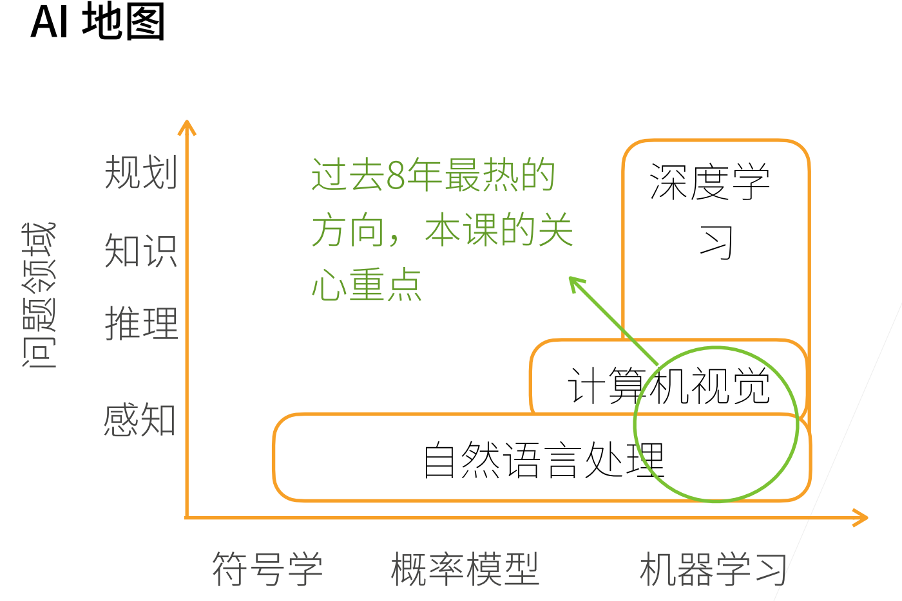
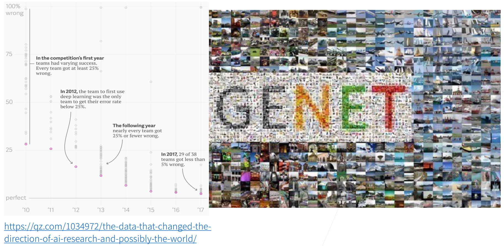
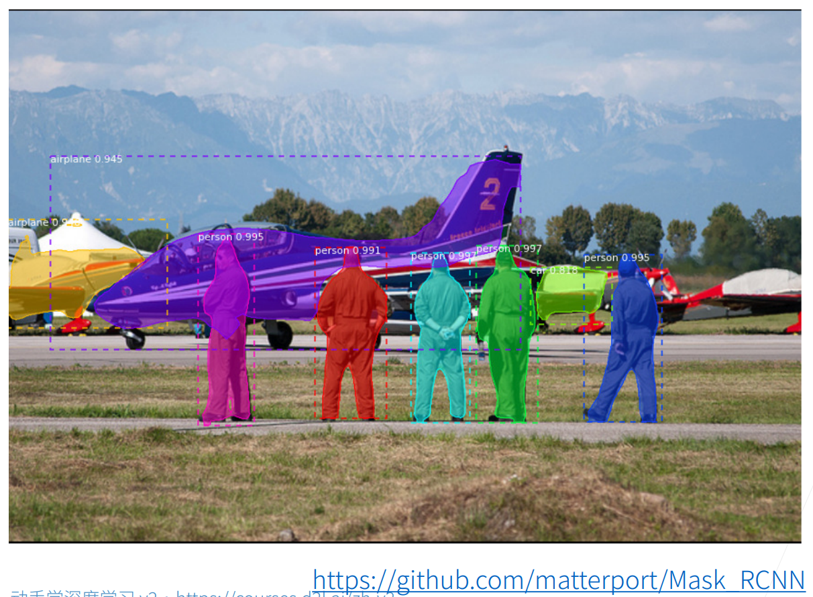
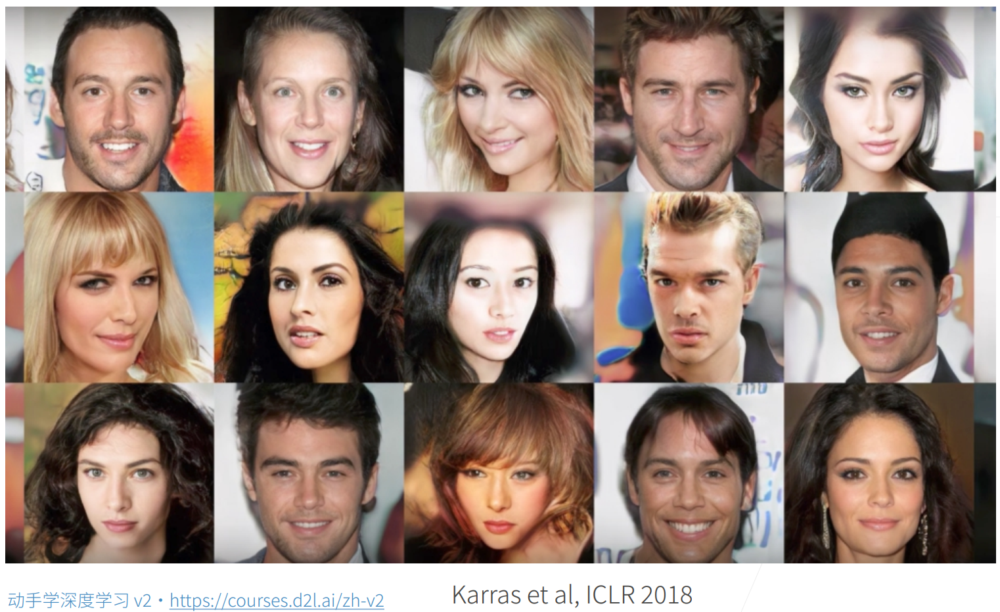
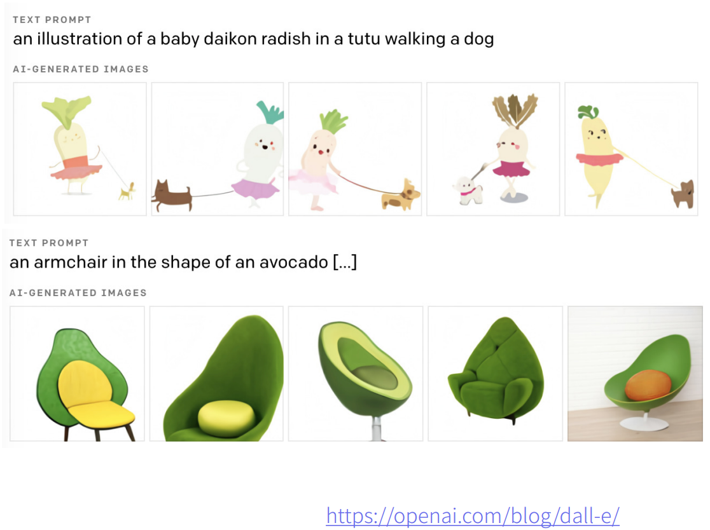
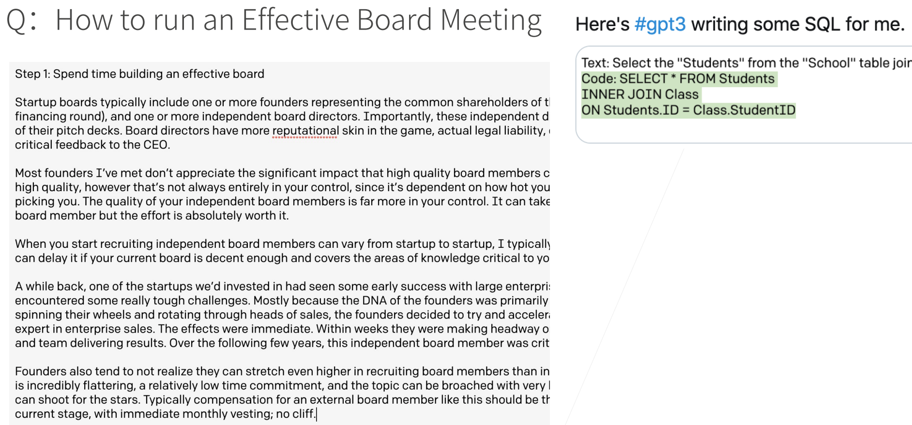
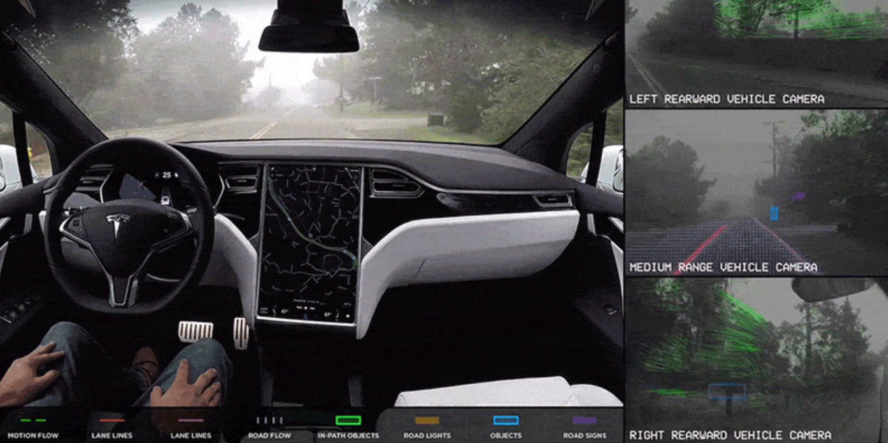
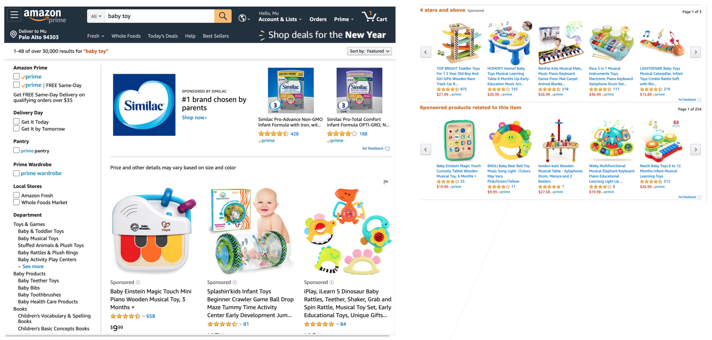
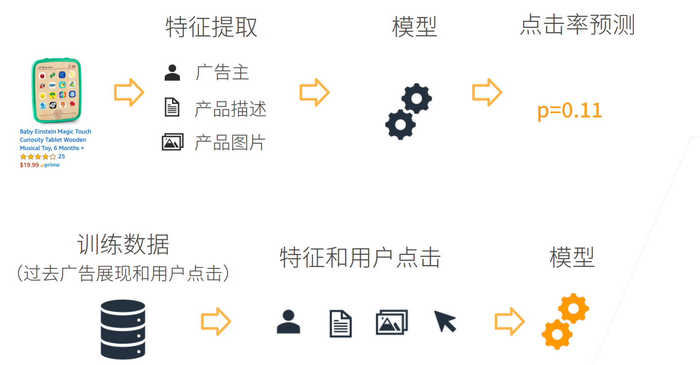
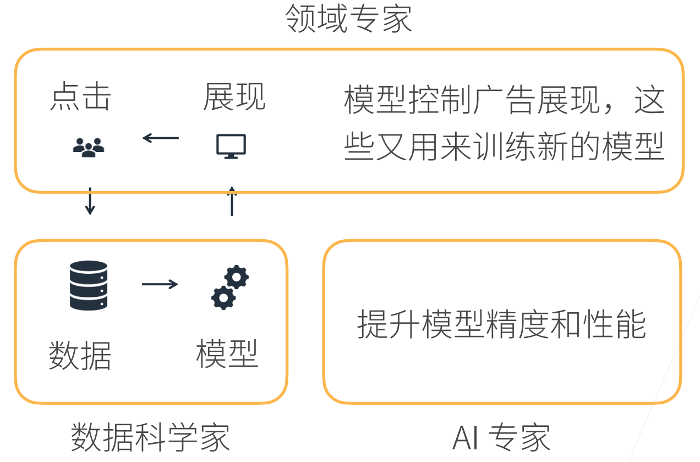

# 02 介绍

沐神视频讲解：[B站](https://www.bilibili.com/video/BV1J54y187f9/)

教材：[zh-v2.d2l.ai](https://zh-v2.d2l.ai/chapter_introduction/index.html)

## 机器学习中的关键组件

1. 可以用来学习的*数据*（data）
2. 如何转换数据的*模型*（model）
3. 一个*目标函数*（objective function），用来量化模型的有效性
4. 调整模型参数以优化目标函数的*算法*（algorithm）

## 图片分类

IMAGENET

2017年的时候 错误率就已经降到5%以下了

## 物体检测和分割

## 样式迁移

## 人脸合成

## 文字生成图片

## 文字生成

## 无人驾驶

## 案例分析-广告点击

## 预测与训练

## 完整的故事

