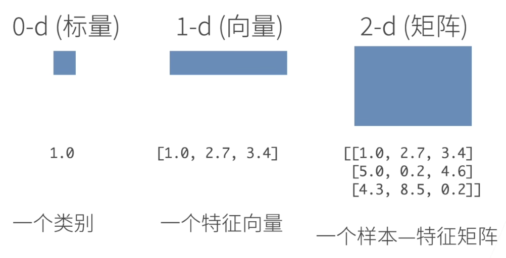
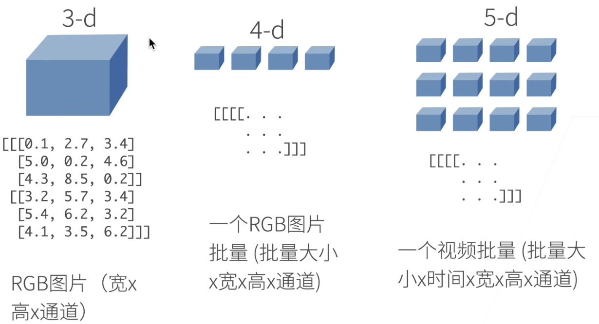
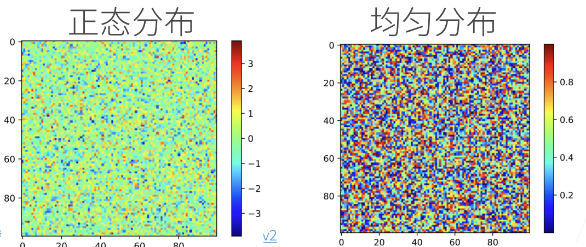
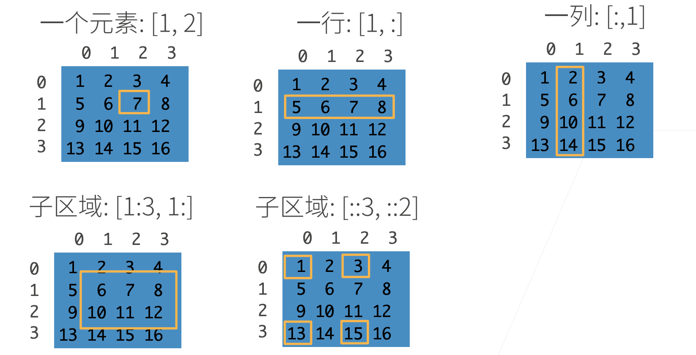

# 04 数据操作和预处理
沐神视频讲解：[数据操作](https://www.bilibili.com/video/BV1CV411Y7i4/)、[数据预处理](https://www.bilibili.com/video/BV1CV411Y7i4?p=3)

教材：[数据操作](https://zh-v2.d2l.ai/chapter_preliminaries/ndarray.html)、[数据预处理](https://zh-v2.d2l.ai/chapter_preliminaries/pandas.html)

## 数据操作


### N维数组是机器学习和神经网络的主要数据结构





### 创建数组需要

- 形状：例如3 x 4矩阵
- 每个元素的数据类型：例如32位浮点数
- 每个元素的值，例如全是0，或者随机数



### 访问元素



### Code（太简单了，就写在一起了

#### 数据操作

```python
# 导入pytorch
import torch
# 张量表示一个由数值组成的数组，这个数组可能有多个维度
x = torch.arange(12) # tensor([ 0, 1, 2, 3, 4, 5, 6, 7, 8, 9, 10, 11])

# 可以通过张量的shape属性来访问张量（沿每个轴的长度）的*形状和张量中元素的总数
x.shape # torch.Size([12])
x.numel() # 12

# 要想改变一个张量的形状而不改变元素数量和元素值，可以调用reshape函数
X = x.reshape(3, 4) # tensor([[ 0,  1,  2,  3],[ 4,  5,  6,  7],[ 8,  9, 10, 11]])

# 使用全0、全1、其他常量，或者从特定分布中随机采样的数字
torch.zeros((2, 3, 4))
torch.ones((2, 3, 4))
torch.randn(3, 4)

# 通过提供包含数值的Python列表（或嵌套列表），来为所需张量中的每个元素赋予确定值
torch.tensor([[2, 1, 4, 3], [1, 2, 3, 4], [4, 3, 2, 1]])

#常见的标准算术运算符（+、-、*、/和**）都可以被升级为按元素运算
x = torch.tensor([1.0, 2, 4, 8])
y = torch.tensor([2, 2, 2, 2])
x + y, x - y, x * y, x / y, x ** y 
# “按元素”方式可以应用更多的计算
torch.exp(x)

# 可以把多个张量连结（concatenate）在一起
X = torch.arange(12, dtype=torch.float32).reshape((3,4))
Y = torch.tensor([[2.0, 1, 4, 3], [1, 2, 3, 4], [4, 3, 2, 1]])
torch.cat((X, Y), dim=0), torch.cat((X, Y), dim=1)
# (tensor([[ 0.,  1.,  2.,  3.],
#          [ 4.,  5.,  6.,  7.],
#          [ 8.,  9., 10., 11.],
#          [ 2.,  1.,  4.,  3.],
#          [ 1.,  2.,  3.,  4.],
#          [ 4.,  3.,  2.,  1.]]),
# tensor([[ 0.,  1.,  2.,  3.,  2.,  1.,  4.,  3.],
#         [ 4.,  5.,  6.,  7.,  1.,  2.,  3.,  4.],
#         [ 8.,  9., 10., 11.,  4.,  3.,  2.,  1.]]))

# 通过逻辑运算符构建二元张量
X == Y
# tensor([[False,  True, False,  True],
#        [False, False, False, False],
#        [False, False, False, False]])

# 对张量中的所有元素进行求和，会产生一个单元素张量
X.sum()

# 即使形状不同，我们仍然可以通过调用广播机制（broadcasting mechanism）来执行按元素操作
a = torch.arange(3).reshape((3, 1))
b = torch.arange(2).reshape((1, 2))
#(tensor([[0],
#         [1],
#         [2]]),
# tensor([[0, 1]]))
a + b
# tensor([[0, 1],
#        [1, 2],
#        [2, 3]])

# 可以用[-1]选择最后一个元素，可以用[1:3]选择第二个和第三个元素
X[-1], X[1:3]
# (tensor([ 8.,  9., 10., 11.]),
# tensor([[ 4.,  5.,  6.,  7.],
#         [ 8.,  9., 10., 11.]]))

# 除读取外，我们还可以通过指定索引来将元素写入矩阵
X[1, 2] = 9

# 为多个元素赋值相同的值，我们只需要索引所有元素，然后为它们赋值
X[0:2, :] = 12

# 运行一些操作可能会导致为新结果分配内存
before = id(Y)
Y = Y + X
id(Y) == before # False

# 执行原地操作
Z = torch.zeros_like(Y)
print('id(Z):', id(Z))
Z[:] = X + Y
print('id(Z):', id(Z))
# id(Z): 139931132035296 id(Z): 139931132035296

# 如果在后续计算中没有重复使用X，我们也可以使用X[:] = X + Y或X += Y来减少操作的内存开销
before = id(X)
X += Y
id(X) == before # True

# 转换为NumPy张量（ndarray）
A = X.numpy()
B = torch.tensor(A)
type(A), type(B) # (numpy.ndarray, torch.Tensor)

# 将大小为1的张量转换为Python标量
a = torch.tensor([3.5])
a, a.item(), float(a), int(a) # (tensor([3.5000]), 3.5, 3.5, 3)*

```

#### 数据预处理

```python
# 创建一个人工数据集，并存储在CSV（逗号分隔值）文件
import os

os.makedirs(os.path.join('..', 'data'), exist_ok=True)
data_file = os.path.join('..', 'data', 'house_tiny.csv')
with open(data_file, 'w') as f:
    f.write('NumRooms,Alley,Price\n')
    f.write('NA,Pave,127500\n')
    f.write('2,NA,106000\n')
    f.write('4,NA,178100\n')
    f.write('NA,NA,140000\n')

# 从创建的CSV文件中加载原始数据集
import pandas as pd

data = pd.read_csv(data_file)
print(data)
# NumRooms Alley   Price
# 0       NaN  Pave  127500
# 1       2.0   NaN  106000
# 2       4.0   NaN  178100
# 3       NaN   NaN  140000

# 为了处理缺失的数据，典型的方法包括插值法和删除法，这里，我们将考虑插值法
inputs, outputs = data.iloc[:, 0:2], data.iloc[:, 2]
inputs = inputs.fillna(inputs.mean())
print(inputs)
# NumRooms Alley
# 0       3.0  Pave
# 1       2.0   NaN
# 2       4.0   NaN
# 3       3.0   NaN

# 对于inputs中的类别值或离散值，我们将“NaN”视为一个类别
inputs = pd.get_dummies(inputs, dummy_na=True)
print(inputs)
# NumRooms  Alley_Pave  Alley_nan
# 0       3.0           1          0
# 1       2.0           0          1
# 2       4.0           0          1
# 3       3.0           0          1

# 现在inputs和outputs中的所有条目都是数值类型，它们可以转换为张量格式
X, y = torch.tensor(inputs.values), torch.tensor(outputs.values)
X, y
# (tensor([[3., 1., 0.],
#         [2., 0., 1.],
#         [4., 0., 1.],
#         [3., 0., 1.]], dtype=torch.float64),
# tensor([127500, 106000, 178100, 140000]))
```