# 05 线性代数
沐神视频讲解：[B站](https://www.bilibili.com/video/BV1eK4y1U7Qy)

教材：[zh-v2.d2l.ai](https://zh-v2.d2l.ai/chapter_preliminaries/linear-algebra.html)
## 标量

- 简单操作
  
    $c = a + b$
    
    $c = a * b$
    
    $c = sin a$
    
- 长度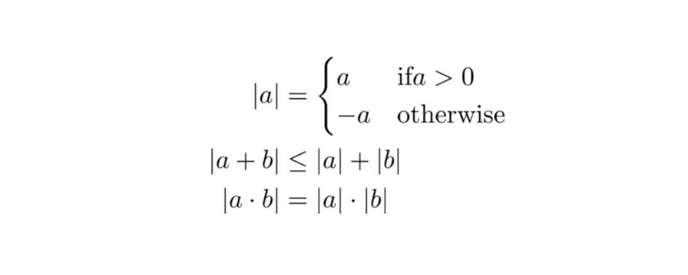
  

## 向量

- 简单操作
  
    $c = a + b  （where \ c_i = a_i + b_i$
    
    $c = a * b   （where \ c_i =$ $\ \alpha$$b_i$
    
    $c = sin\ a    （where\ c_i = sin\ a_i$
    
- 长度
  

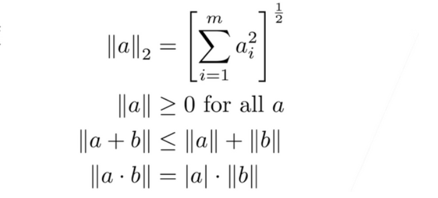
    

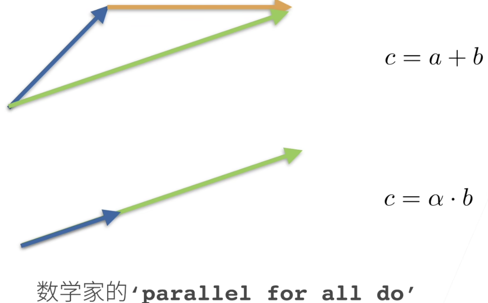

- 点乘
  
    $a^Tb\ = \ \sum_{i} a_ib_i$
    
- 正交
  
    $a^Tb\ = \sum_{i} a_ib_i \ = \ 0$
    

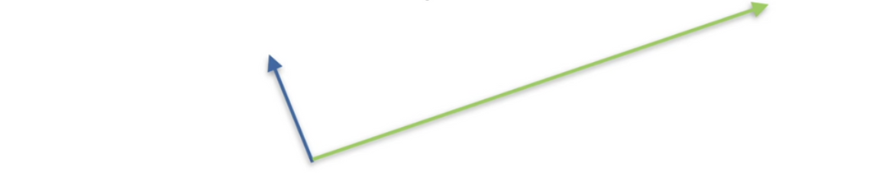

## 矩阵

- 简单操作
  
    $C = A + B \ where\ C_{ij} = A_{ij} + B_{ij}$
    
    $C = \alpha * B \ where\ C_{ij} = \alpha * B_{ij}$
    
    $C = sinA \ where\ C_{ij} = sinA_{ij}$
    
- 乘法（矩阵乘以向量）
  
    $c = Ab\ where\ c_i = \sum_{j} A_{ij}b_j$
    

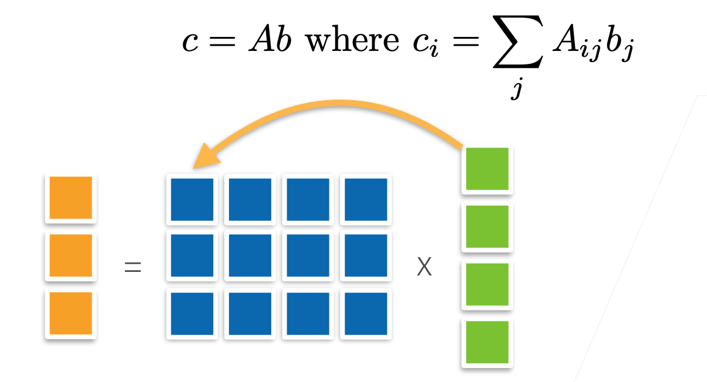
    
- 乘法（矩阵乘以矩阵）
  

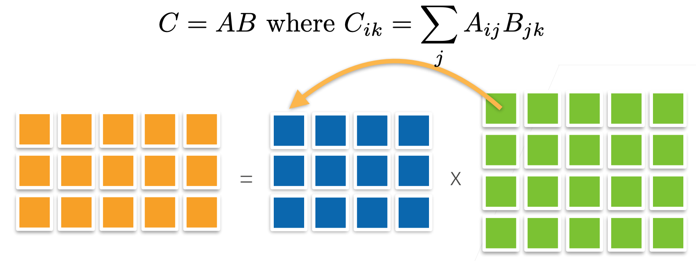
    
- 范数
  


    
    - 取决于如何衡量b和c的长度
- 常见范数
    - 矩阵范数：最小的满足上面公式的值
    - Frobenius范数
      
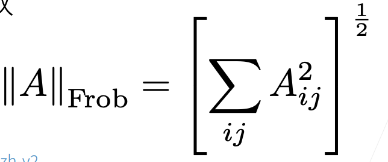
        

## 特殊矩阵

- 对称和反对称
  

    

    
- 正定
  

    
- 正交矩阵
    - 所有行都相互正交
    - 所有行都有单位长度
      
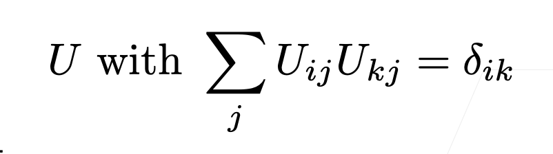
        
    - 可以写成$UU^T = 1$
- 置换矩阵
  

    
    - 置换矩阵是正交矩阵

## 矩阵

- 特征向量和特征值
    - 不被矩阵改变方向的向量
      
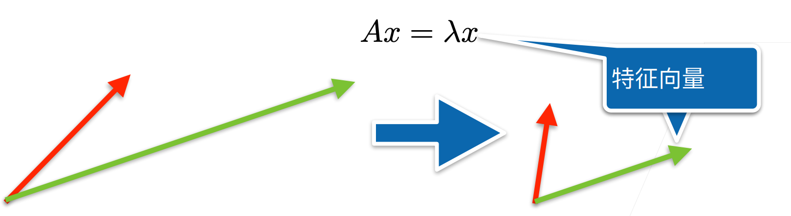
        
    - 对称矩阵总是可以找到特征向量

## Code

```python
# 标量由只有一个元素的张量表示
import torch

x = torch.tensor(3.0)
y = torch.tensor(2.0)

x + y, x * y, x / y, x**y
# (tensor(5.), tensor(6.), tensor(1.5000), tensor(9.))

# 向量可以被视为标量值组成的列表
x = torch.arange(4) # tensor([0, 1, 2, 3])

# 通过张量的索引来访问任一元素
x[3] # tensor(3)

# 访问张量的长度
len(x) # 4

# 只有一个轴的张量，形状只有一个元素
x.shape # torch.Size([4])

# 通过指定两个分量m和n来创建一个形状为m x n的矩阵
A = torch.arange(20).reshape(5, 4)
# tensor([[ 0,  1,  2,  3],
#         [ 4,  5,  6,  7],
#         [ 8,  9, 10, 11],
#         [12, 13, 14, 15],
#         [16, 17, 18, 19]])

# 矩阵的转置
A.T
# tensor([[ 0,  4,  8, 12, 16],
#         [ 1,  5,  9, 13, 17],
#         [ 2,  6, 10, 14, 18],
#         [ 3,  7, 11, 15, 19]])

# 对称矩阵（symmetric matrix）A 等于其转置：A = A^T
B = torch.tensor([[1, 2, 3], [2, 0, 4], [3, 4, 5]])
# tensor([[1, 2, 3],
#         [2, 0, 4],
#         [3, 4, 5]])

B == B.T
# tensor([[True, True, True],
#         [True, True, True],
#         [True, True, True]])

# 就像向量是标量的推广，矩阵是向量的推广一样，我们可以构建具有更多轴的数据结构
X = torch.arange(24).reshape(2, 3, 4)
# tensor([[[ 0,  1,  2,  3],
#          [ 4,  5,  6,  7],
#          [ 8,  9, 10, 11]],

#          [[12, 13, 14, 15],
#          [16, 17, 18, 19],
#          [20, 21, 22, 23]]])

# 给定具有相同形状的任意两个张量，任何按元素二元运算的结果都将是相同形状的张量
A = torch.arange(20, dtype=torch.float32).reshape(5, 4)
B = A.clone()
A, A + B
# (tensor([[ 0.,  1.,  2.,  3.],
#          [ 4.,  5.,  6.,  7.],
#          [ 8.,  9., 10., 11.],
#          [12., 13., 14., 15.],
#          [16., 17., 18., 19.]]),
#  tensor([[ 0.,  2.,  4.,  6.],
#          [ 8., 10., 12., 14.],
#          [16., 18., 20., 22.],
#          [24., 26., 28., 30.],
#          [32., 34., 36., 38.]]))

# 两个矩阵的按元素乘法称为*Hadamard积*（Hadamard product）
A * B
# tensor([[  0.,   1.,   4.,   9.],
#         [ 16.,  25.,  36.,  49.],
#         [ 64.,  81., 100., 121.],
#         [144., 169., 196., 225.],
#         [256., 289., 324., 361.]])

a = 2
X = torch.arange(24).reshape(2, 3, 4)
a + X, (a * X).shape
# (tensor([[[ 2,  3,  4,  5],
#           [ 6,  7,  8,  9],
#           [10, 11, 12, 13]],
 
#          [[14, 15, 16, 17],
#           [18, 19, 20, 21],
#           [22, 23, 24, 25]]]),
#  torch.Size([2, 3, 4]))

# 计算其元素的和
x = torch.arange(4, dtype=torch.float32)
x, x.sum()
# (tensor([0., 1., 2., 3.]), tensor(6.))

# 表示任意形状张量的元素和
A.shape, A.sum()
# (torch.Size([5, 4]), tensor(190.))

# 指定张量沿哪一个轴来通过求和降低维度
A_sum_axis0 = A.sum(axis=0)
A_sum_axis0, A_sum_axis0.shape
# (tensor([40., 45., 50., 55.]), torch.Size([4]))

A_sum_axis1 = A.sum(axis=1)
A_sum_axis1, A_sum_axis1.shape
# (tensor([ 6., 22., 38., 54., 70.]), torch.Size([5]))

A.sum(axis=[0, 1])
# tensor(190.)

# 一个与求和相关的量是平均值（mean或average）
A.mean(), A.sum() / A.numel()
# (tensor(9.5000), tensor(9.5000))

A.mean(axis=0), A.sum(axis=0) / A.shape[0]
# (tensor([ 8.,  9., 10., 11.]), tensor([ 8.,  9., 10., 11.]))

# 计算总和或均值时保持轴数不变
sum_A = A.sum(axis=1, keepdims=True)
# tensor([[ 6.], [22.], [38.], [54.], [70.]])

# 通过广播将A除以sum_A
A / sum_A
# tensor([[0.0000, 0.1667, 0.3333, 0.5000],
#         [0.1818, 0.2273, 0.2727, 0.3182],
#         [0.2105, 0.2368, 0.2632, 0.2895],
#         [0.2222, 0.2407, 0.2593, 0.2778],
#         [0.2286, 0.2429, 0.2571, 0.2714]])

# 某个轴计算A元素的累积总和
A.cumsum(axis=0)
# tensor([[ 0.,  1.,  2.,  3.],
#         [ 4.,  6.,  8., 10.],
#         [12., 15., 18., 21.],
#         [24., 28., 32., 36.],
#         [40., 45., 50., 55.]])

# 点积是相同位置的按元素乘积的和
y = torch.ones(4, dtype = torch.float32)
x, y, torch.dot(x, y)
# (tensor([0., 1., 2., 3.]), tensor([1., 1., 1., 1.]), tensor(6.))

# 我们可以通过执行按元素乘法，然后进行求和来表示两个向量的点积
torch.sum(x * y)
# tensor(6.)

# 矩阵向量积Ax是一个长度为m的列向量
A.shape, x.shape, torch.mv(A, x)
# (torch.Size([5, 4]), torch.Size([4]), tensor([ 14.,  38.,  62.,  86., 110.]))

# 我们可以将矩阵-矩阵乘法AB看作简单地执行m次矩阵-向量积，并将结果拼接在一起，形成一个n x m矩阵
B = torch.ones(4, 3)
torch.mm(A, B)
# tensor([[ 6.,  6.,  6.],
#         [22., 22., 22.],
#         [38., 38., 38.],
#         [54., 54., 54.],
#         [70., 70., 70.]])
```

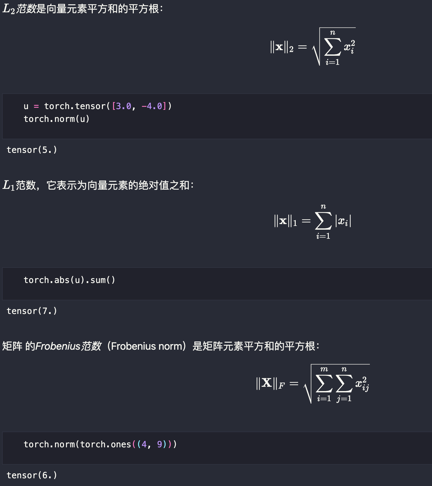

## 补充


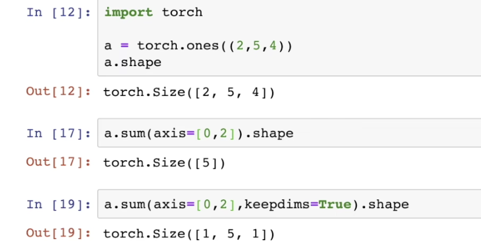