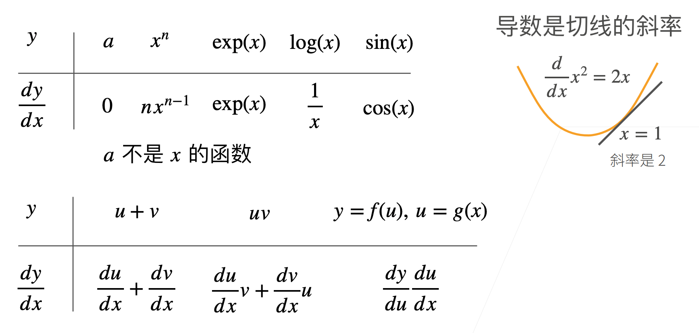
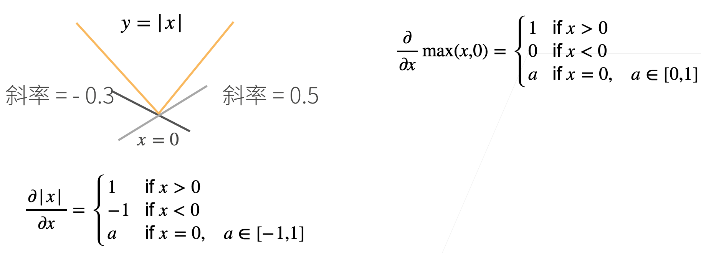
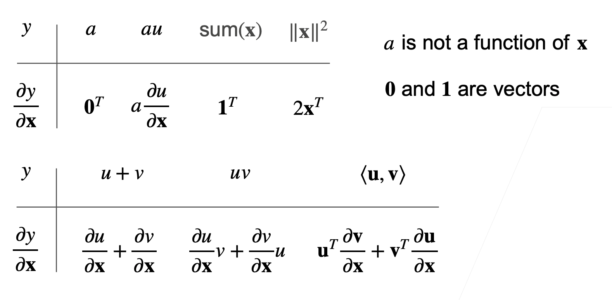
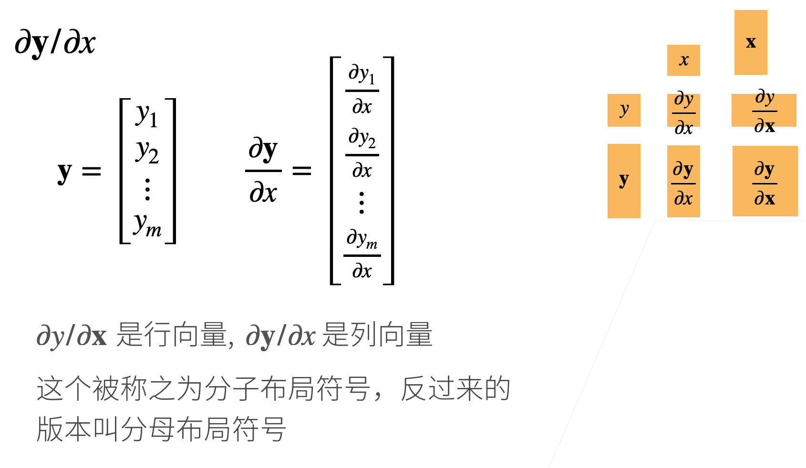
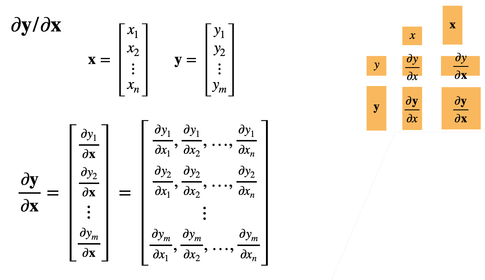
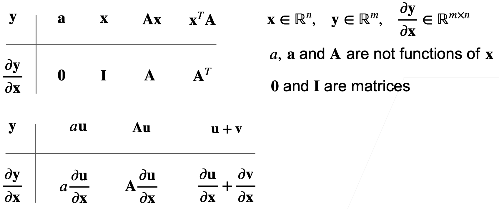
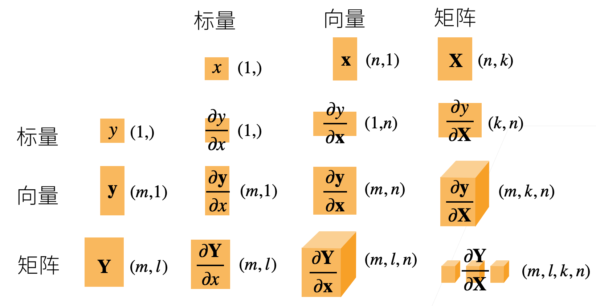

# 06 矩阵计算
沐神视频讲解：[B站](https://www.bilibili.com/video/BV1eZ4y1w7PY)

教材：[zh-v2.d2l.ai](https://zh-v2.d2l.ai/chapter_preliminaries/calculus.html)
## 标量导数

## 亚导数

- 将导数扩展到不可微的函数

## 梯度

## 样例

### 拓展到矩阵

