# 07 自动求导
沐神视频讲解：[B站](https://www.bilibili.com/video/BV1KA411N7Px)

教材：[zh-v2.d2l.ai](https://zh-v2.d2l.ai/chapter_preliminaries/autograd.html)
## 向量链式法则

- 标量链式法则
  

    
- 拓展到向量
  
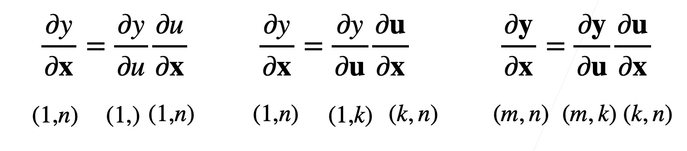
    

### 🌰 1

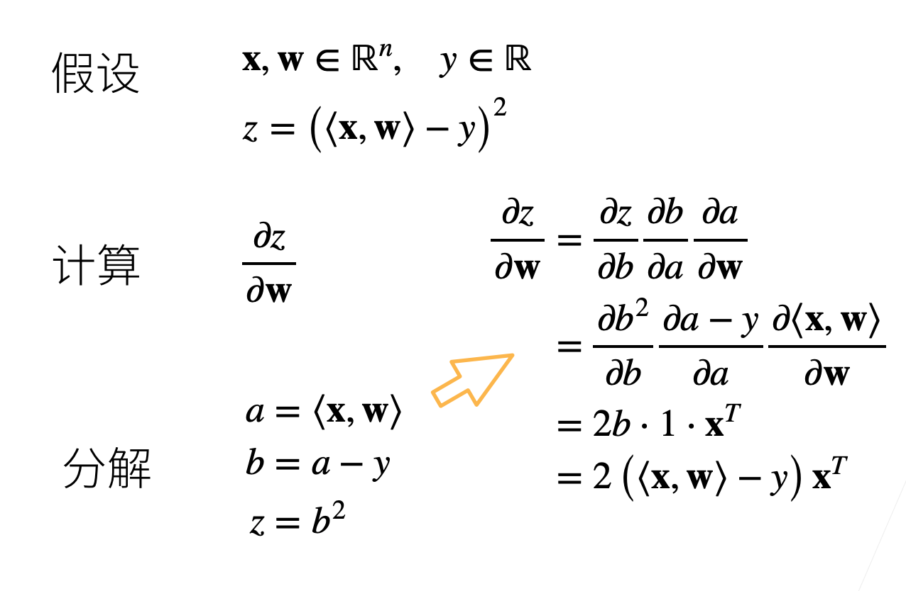

### 🌰 2

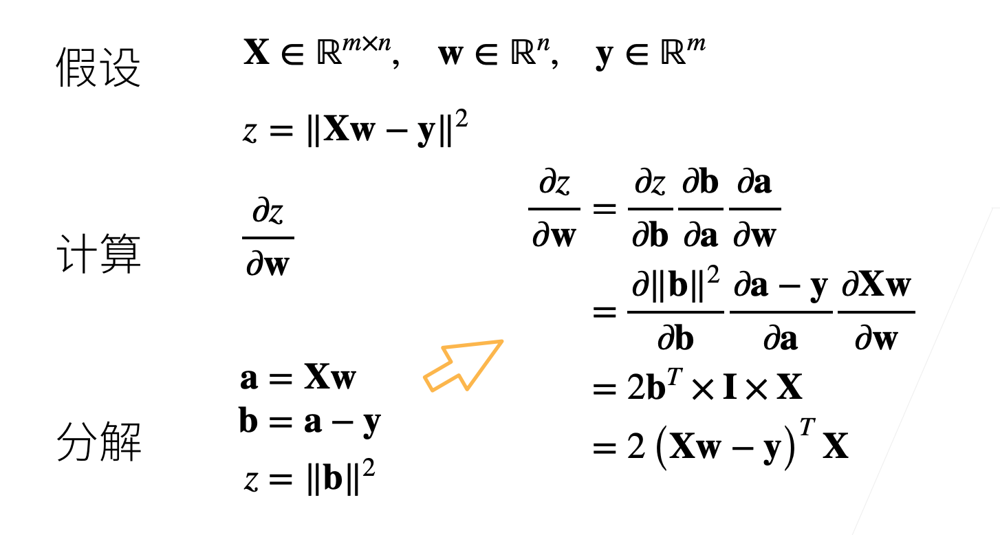

## 自动求导

- 自动求导计算一个函数在指定值上的导数
- 它有别于
    - 符号求导
      

        
    - 数值求导
      

        

### 计算图

- 将代码分解成操作子
- 将计算表示成一个无环图
  
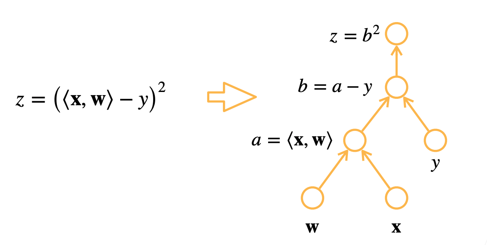
    
- 显示构造
  
    ```python
    from mxnet import sym
    a = sym.var()
    b = sym.var()
    c = 2 * a + b
    #bind data into a and b later
    ```
    

### 自动求导的两种模式

- 链式法则：
  
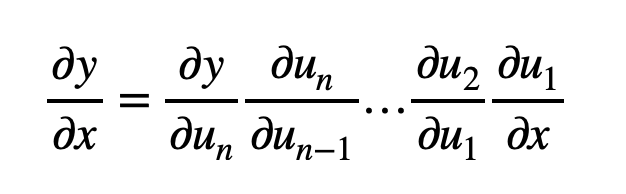
    
- 正向累积：
  
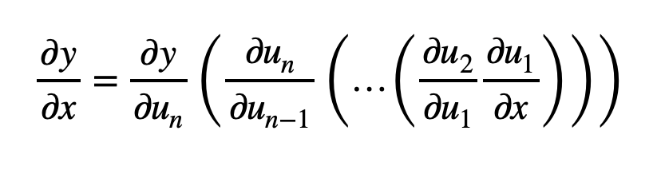
    
- 反向累积、又称反向传递：
  
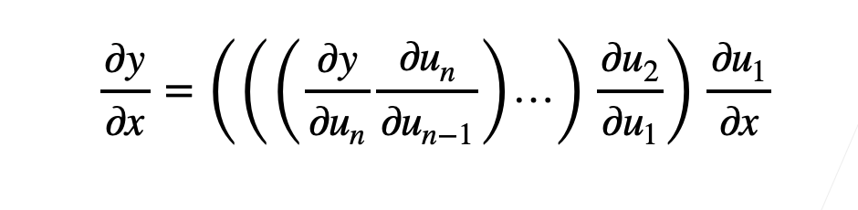
    

#### 反向累积

1、

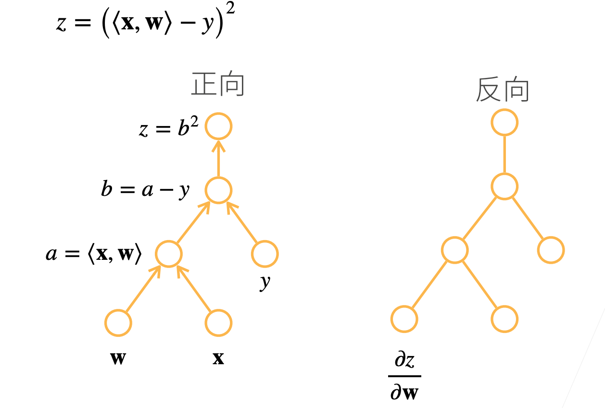

2、

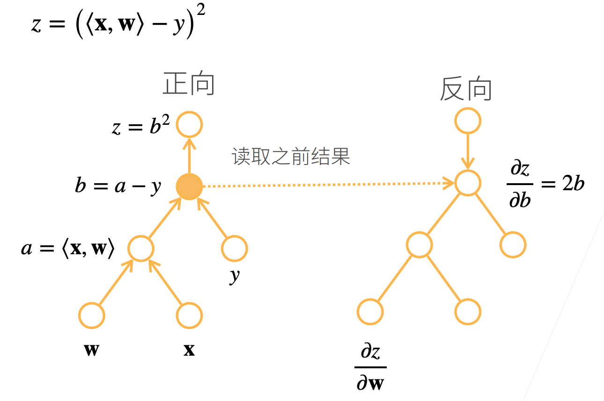

3、

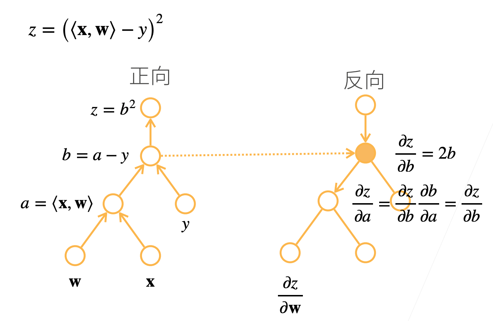

4、

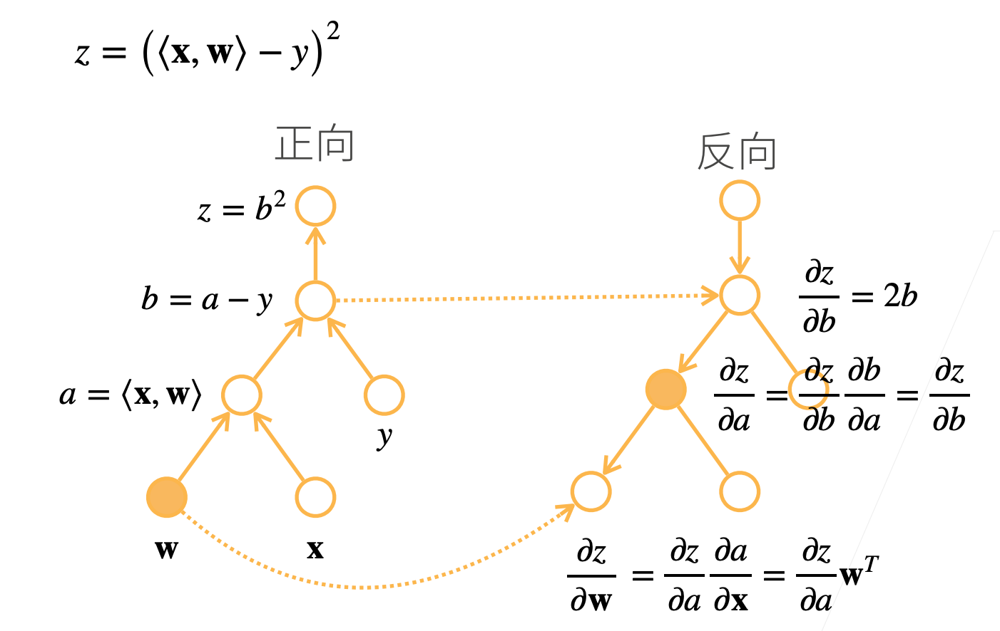

##### 总结

- 构造计算图
- 前向：执行图，存储中间结果
- 反向：从相反方向执行图
    - 去除不需要的枝
      
        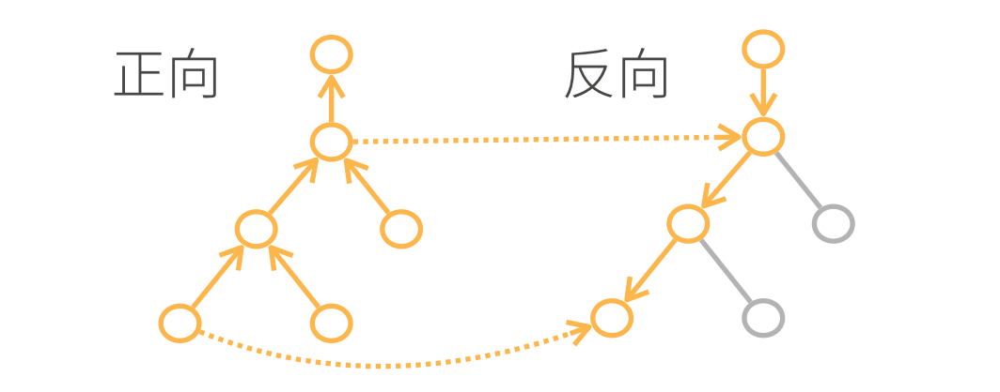
        

##### 复杂度

- 计算复杂度：O(n), n是操作子个数
    - 通常正向和反向的代价类似
- 内存复杂度：O(n), 因为需要存储正向的所有中间结果
- 跟正向累积对比：
    - O(n)计算复杂度用来计算一个变量的梯度
    - O(1)内存复杂度

## Code

```python
# 假设我们想对函数y=2 x^T x关于列向量x求导
import torch

x = torch.arange(4.0) # tensor([0., 1., 2., 3.])

# 在我们计算y关于x的梯度之前，需要一个地方来存储梯度
x.requires_grad_(True)
x.grad

# 现在计算y
y = 2 * torch.dot(x, x) # tensor(28., grad_fn=<MulBackward0>)

# 通过调用反向传播函数来自动计算y关于x每个分量的梯度
y.backward()
x.grad # tensor([ 0.,  4.,  8., 12.])

x.grad == 4 * x # tensor([True, True, True, True])

# 现在计算x的另一个函数
x.grad.zero_()
y = x.sum()
y.backward()
x.grad # tensor([1., 1., 1., 1.])

# 深度学习中，我们的目的不是计算微分矩阵，而是单独计算批量中每个样本的偏导数之和
x.grad.zero_()
y = x * x
y.sum().backward()
x.grad # tensor([0., 2., 4., 6.])

# 将某些计算移动到记录的计算图之外
x.grad.zero_()
y = x * x
u = y.detach()
z = u * x

z.sum().backward()
x.grad == u # tensor([True, True, True, True])

x.grad.zero_()
y.sum().backward()
x.grad == 2 * x # tensor([True, True, True, True])

# 即使构建函数的计算图需要通过Python控制流（例如，条件、循环或任意函数调用），我们仍然可以计算得到的变量的梯度
def f(a):
    b = a * 2
    while b.norm() < 1000:
        b = b * 2
    if b.sum() > 0:
        c = b
    else:
        c = 100 * b
    return c

a = torch.randn(size=(), requires_grad=True)
d = f(a)
d.backward()

a.grad == d / a # tensor(True)
```