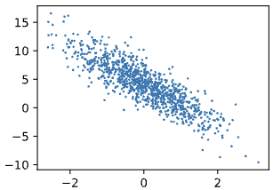

# 3 线性回归+基础优化算法

沐神视频讲解：[B站](https://www.bilibili.com/video/BV1PX4y1g7KC)

教材：[zh-v2.d2l.ai](https://zh-v2.d2l.ai/chapter_linear-networks/linear-regression.html)

## 3.1 线性回归

### 3.1.1 举例

**3.1.1.1 如何在美国买房**


**3.1.1.2 一个简化模型**

- 假设1: 影响房价的关键因素是卧室个数，卫生间个数，和居住面积，记为$x_1, x_2, x_3$
- 假设2: 成交价是关键因素的加权和 $y=w_1x_1+w_2x_2+w_3x_3+b$
  
    权重和偏差的实际值在后面决定
    

### 3.1.2 线性模型

- 给定n维输入$x=[x_1,x_2,...,x_n]^T$
- 线性模型有一个n维`权重`和一个标量`偏置`
  
    $w = [w_1, w_2,..., w_n]^T, b$ 
    
    $w$：`权重`决定了每个特征对预测值的影响 
    
    $b$：`偏置`是指当所有特征都取值为0时，预测值应该为多少
    
- 输出是输入的加权和
  
    $\hat{y} = w_1x_1 + w_2x_2 + ... + w_dx_d + b$  (3.1)
    
    向量版本：
    
    - $y = <w, x> + b$
    - 向量**x** $\in R^d$对应于单个数据样本的`特征`，所有权重放在向量**w** $\in R^d$中
      
         $\hat{y}$ = **w**$^T$**x** + b
        
    - 特征集合$X\in R^{n*d}$的每一行是一个样本，每一列是一种特征，`预测值`$\hat{y} \in R^n$
    
    $\hat{y}$  = **wX** + b
        
    
  式子(3.1)是输入特征的一个`仿射变换`(affine transformation)，仿射变换的特点是通过加权和对特征进行`线性变换`(linear transformation)，并通过偏置项来进行`平移`(translation)
  
  输出的预测值由输入特征通过线性模型的仿射变换决定，仿射变换由所选权重和偏置确定
  
  给定训练·数据特征·**X**和对应的`已知标签`**y**， 线性回归的目标是找到一组权重向量**w**和偏置b： 当给定从**X**的同分布中取样的新样本特征时， 这组权重向量和偏置能够使得`新样本预测标签`的误差尽可能小
  
    > 巴拉巴拉俗话说就是，有一天你要去买房，然后想知道房价大概是多少，但是你去看了房子，只知道卧室有几个，卫生间有几个，居住面积有多大，自己也评估不出来要多少钱，又怕被中介骗了，这个时候模型就有用了，你把你知道的这些关于房子的特征(**X**)全部输入到这个模型里，然后它就告诉你房价($\hat{y}$)大概是多少
    >
    > 但是房子特征那么多，总不会每一个特征都同样重要，这个时候就要有一组参数相当于是每个特征比例，跟特征乘一下，再相加得到最后的房价预测
    >
    > 参数是根据以往的经验得的，看以前真实的房子特征对应的真实房价是多少，找出它们之间的规律，得出这一组参数**w**
    >
    > 炼丹师要干的事情，炼出一组最好的参数让预测值更接近于真实值

在开始寻找最好的`模型参数`(model parameters) **w**和b之前， 我们还需要两个东西： 

（1）一种模型质量的度量方式； 

（2）一种能够更新模型以提高模型预测质量的方法

### 3.1.3 衡量预估质量（损失函数

`损失函数`(loss function)：能够量化目标的实际值与预测值之间的差距（非负数作为损失，数值越小损失越小，完美预测即为0

**3.1.3.1 举例**

比较真实值和预估值，例如房屋售价和估价

**3.1.3.2 平方误差函数（常用损失函数**

$l^{(i)}(w,b) = \frac{1}{2}(\hat{y}^{(i)} - y^{(i)})^2$

$\frac{1}{2}$主要是为了求导后跟指数上的2相乘为1，由于训练数据集并不受我们控制，所以`经验误差`只是关于模型参数的函数


为了度量模型在整个数据集上的质量，需计算在训练集$n$个样本上的`损失均值`（也等价于求和）

$L(w, b) = \frac{1}{n} \sum\limits_{i=1}^n l^{(i)}(w,b) = \frac{1}{n} \sum\limits_{i=1}^n \frac{1}{2}(w^Tx^{(i)} + b - y^{(i)})^2$ 

炼丹师要找出一组参数($w^*, b^*$)，这组参数能最小化在所有训练样本上的`总损失`（即让预测值更接近真实值

$w^*, b^* = \mathop{argmin}\limits_{w,b} L(w,b)$

### 3.1.4 解析解

线性回归刚好是一个很简单的优化问题，线性回归的解可以用一个公式简单地表达出来， 这类解叫作`解析解`(analytical solution)

1. 将偏差加入权重
   
    $X \leftarrow [X, 1]$ 
    
    $w \leftarrow \left\lfloor \begin{matrix} w \\ b \end{matrix}  \right\rfloor$
    
2. 损失函数
   
    预测问题是最小化$l(X, y, w)$，这在损失平面上只有一个`临界点`，这个临界点对应于整个区域的`损失极小点`
    
    $l(X, y, w) = \frac{1}{2n} ||y - Xw||^2$
    
    $\frac{\partial }{\partial w} l(X, y, w) = \frac{1}{n}(y - Xw)^T X$
    
3. 损失是`凸函数`，所以最优解满足
   
    $\frac{\partial }{\partial w} l(X, y, w) = 0$
    
    $\Leftrightarrow$ $\frac{1}{n} (y - Xw)^T X = 0$
    
    $\Leftrightarrow$ $w^* = (X^TX)^{-1} X^T y$
    

> 像线性回归这样的简单问题存在解析解，但并不是所有的问题都存在解析解。 解析解可以进行很好的数学分析，但解析解对问题的限制很严格，导致它无法广泛应用在深度学习里
> 

## 3.2 基础优化方法

### 3.2.1 梯度下降

#### Overview

> 一个模型没有显示解(解析解 的时候该怎么办呢？ 
选择梯度下降方法(这种方法几乎可以优化所有深度学习模型
> 

梯度下降最简单的用法是计算`损失函数`（数据集中所有样本的`损失均值`） 关于`模型参数`的`导数`（在这里也可以称为`梯度`）

how?

先挑选一个参数的`随机初始值`，记为$W_0$，在后面不断更新$W_0$的值，使得它接近我们的`最优解`

- 挑选一个模型参数初始值$w_0$
- 重复迭代参数$t=1,2,3$
  
    
    

> $W_{t-1}$：上个时刻的参数值  
$\eta$：`学习率`(learning rate)(标量  
$\frac{\partial l}{\partial w_{t-1}}$：损失函数$l$对$w_{t-1}$的梯度
沿梯度方向将增加损失函数值，所以要在负梯度的方向上更新参数
> 

直观看图说话：

1⃣️ 外圈值最大，同一圈上的值一样

2⃣️ $W_0$:随机取的值

3⃣️ 梯度负方向(♦️：函数值下降最快的方向

4⃣️ $\eta$：沿着这个方向每一次走多远


### 3.2.2 选择学习率


太小：收敛慢

太大：容易错过最优点

### 3.2.3 小批量随机梯度下降(minibatch stochastic gradient descent)

- 在整个训练集上算梯度太贵
    - 一个深度神经网络模型可能需要数分钟至数小时
- 我们可以`随机采样`b个样本$i_1, i_2, ..., i_b$来`近似损失`
    - b是`批量大小`(batch size)，另一个重要的hyperparameter
    
    $\frac{1}{b} \sum\limits_{i \in I_b} l(X_i, y_i, w)$
    

> 用随机的b个样本近似所有样本的损失，b值大的话，近似精确，b值小的话，近似不太精确，但是梯度比较好算，梯度计算的复杂度跟样本的个数是线性相关的
> 

### 3.2.4 选择批量大小

- 不能太小 —— 每次计算量太小，不适合并行来最大利用计算资源
- 不能太大 —— 内存消耗增加，浪费计算，例如如果所有样本都是相同的

### 3.2.5 用模型进行预测

给定“已学习”的线性回归模型$w^⊤x+b$， 现在我们可以通过房屋面积$x_1$和房龄$x_2$来估计一个（未包含在训练数据中的）新房屋价格。 给定特征估计目标的过程通常称为`预测`(prediction)或`推断`(inference)

d2l中将尝试坚持使用`预测`这个词。 虽然`推断`这个词已经成为深度学习的标准术语，但其实`推断`这个词有些用词不当。 在统计学中，`推断`更多地表示基于数据集估计参数。 当深度学习从业者与统计学家交谈时，术语的误用经常导致一些误解

### 3.2.6 总结

- 小批量随机梯度下降是深度学习默认的求解算法(虽然有更好的算法，一般来说是最稳定和最简单的
- `批量大小`和`学习率`的值通常是手动预先指定，而不是通过模型训练得到的。 这些可以调整但不在训练过程中更新的参数称为`超参数`(hyperparameter)。
- `调参`(hyperparameter tuning)是选择超参数的过程。 超参数通常是我们根据训练迭代结果来调整的， 而训练迭代结果是在独立的`验证数据集`(validation dataset)上评估得到的
  
    (说人话就是看模型在`验证集`上的效果来手动选择`超参数`
    
- 事实上，更难做到的是找到一组参数，这组参数能够在我们从未见过的数据上实现较低的损失， 这一挑战被称为*泛化*(generalization）

## 3.3 线性回归的从零开始实现

> 我们将从零开始实现整个方法，包括数据流水线、模型、损失函数和小批量随机梯度下降优化器
> 

```python
%matplotlib inline # plot的时候默认嵌入到notebook里面
import random
import torch
from d2l import torch as d2l
```

> 根据带有噪声的线性模型构造一个人造数据集。我们使用线性模型参数$w={[2,-3.4]}^T、b=4.2$和噪声项c生成数据集及其标签：$y=Xw+b+c$
> 

```python
def synthetic_data(w, b, num_examples):  
    """生成y=Xw+b+噪声"""
    # 均值为0，方差为1的随机数，num_examples样本个数，len(w)列的个数
    X = torch.normal(0, 1, (num_examples, len(w))
    y = torch.matmul(X, w) + b
    # 均值为0，方差为1的随机噪音，形状跟y一样
    y += torch.normal(0, 0.01, y.shape)
    # X,y作为列向量返回
    return X, y.reshape((-1, 1))
		
true_w = torch.tensor([2, -3.4])
true_b = 4.2
features, labels = synthetic_data(true_w, true_b, 1000)
```

> features 中的每一行都包含一个`二维数据样本`，labels中的每一行都包含`一维标签值`（一个标量)
> 

```python
print('features:', features[0],'\nlabel:', labels[0])
```

- Output
  
    features: tensor([-0.3679, -1.3471])
    label: tensor([9.7361])
    

```python
d2l.set_figsize()
d2l.plt.scatter(features[:, 1].detach().numpy(), labels.detach().numpy(), 1);
```

- Output
  
    
    

> 定义一个data_iter函数，该函数接收`批量大小`、`特征矩阵`和`标签向量`作为输入，生成大小为batch_size的`小批量`
> 

```python
def data_iter(batch_size, features, labels):
	# 取的第一维长度
	num_examples = len(features)
    indices = list(range(num_examples))
    # 这些样本是随机读取的，没有特定的顺序
    random.shuffle(indices)
    for i in range(0, num_examples, batch_size):
        batch_indices = torch.tensor(
            indices[i: min(i + batch_size, num_examples)])
        yield features[batch_indices], labels[batch_indices]

batch_size = 10

for X, y in data_iter(batch_size, features, labels):
    print(X, '\n', y)
    break
```

- Output
  
    
    

> 定义`初始化模型参数`
> 

```python
w = torch.normal(0, 0.01, size=(2,1), requires_grad=True)
b = torch.zeros(1, requires_grad=True)
```

> 定义`模型`
> 

```python
def linreg(X, w, b):  
    """线性回归模型"""
    return torch.matmul(X, w) + b
```

> 定义`损失函数`
> 

```python
def squared_loss(y_hat, y):  
    """均方损失"""
    return (y_hat - y.reshape(y_hat.shape)) ** 2 / 2
```

> 定义`优化算法`
> 

```python
def sgd(params, lr, batch_size):  
    """小批量随机梯度下降"""
    # 不需要计算梯度
    with torch.no_grad():
        for param in params:
            param -= lr * param.grad / batch_size
            param.grad.zero_()
```

> 训练过程
> 

```python
lr = 0.03
num_epochs = 3
net = linreg
loss = squared_loss

for epoch in range(num_epochs):
    for X, y in data_iter(batch_size, features, labels):
        l = loss(net(X, w, b), y) # ‘X’和'y'的小批量损失
        # 因为'l'形状是('batch_size', 1),而不是一个标量
        # ‘l’中的所有元素被加到一起，并以此计算关于['w','b']的梯度
        l.sum().backward()
        # 使用参数的梯度更新参数
        sgd([w, b], lr, batch_size)
    with torch.no_grad():
        train_l = loss(net(features, w, b), labels)
        print(f'epoch {epoch + 1}, loss {float(train_l.mean()):f}')
```

比较真实参数和通过训练学到的参数来评估训练的成功程度

```python
print(f'w的估计误差: {true_w - w.reshape(true_w.shape)}')
print(f'b的估计误差: {true_b - b}')
```

- Output
  
    w的估计误差: tensor([ 0.0003, -0.0002])
    b的估计误差: tensor([0.0010])
    

## 3.4 线性回归的简洁实现

通过使用深度学习框架来简洁地实现线性回归模型生成数据集

```python
import numpy as np
import torch
from torch.utils import data
from d2l import torch as d2l

true_w = torch.tensor([2, -3.4])
true_b = 4.2
features, labels = d2l.synthetic_data(true_w, true_b, 1000)
```

调用框架中现有的API来读取数据

```python
def load_array(data_arrays, batch_size, is_train=True):  
    """构造一个PyTorch数据迭代器"""
    dataset = data.TensorDataset(*data_arrays)
    return data.DataLoader(dataset, batch_size, shuffle=is_train)

batch_size = 10
data_iter = load_array((features, labels), batch_size)

next(iter(data_iter))
```

- Output
  
    
    

使用框架的预定义好的层

```python
# 'nn'是神经网络的缩写
from torch import nn
# Sequential: list of layers 2:输入维度 1:输出维度 
net = nn.Sequential(nn.Linear(2, 1))
```

初始化模型参数

```python
net[0].weight.data.normal_(0, 0.01)
net[0].bias.data.fill_(0)
```

- Output
  
    tensor([0.])
    

计算均方误差使用的是MSELoss类，也称为平方$L_2$范数

```python
loss = nn.MSELoss()
```

实例化SGD实例

```python
trainer = torch.optim.SGD(net.parameters(), *lr*=0.03)
```

训练过程代码与我们从零开始实现时所做的非常相似

```python
num_epochs = 3
for epoch in range(num_epochs):
    for X, y in data_iter:
        l = loss(net(X) ,y)
        # 梯度清零
        trainer.zero_grad()
        l.backward()
        # 模型更新
        trainer.step()
    l = loss(net(features), labels)
    print(f'epoch {epoch + 1}, loss {l:f}')
```