# 4 Softmax回归+损失函数

沐神视频讲解：[B站](https://www.bilibili.com/video/BV1K64y1Q7wu)

教材：[zh-v2.d2l.ai](https://zh-v2.d2l.ai/chapter_linear-networks/softmax-regression.html)

## 4.1 Softmax回归

虽然叫回归，但是是一个分类问题

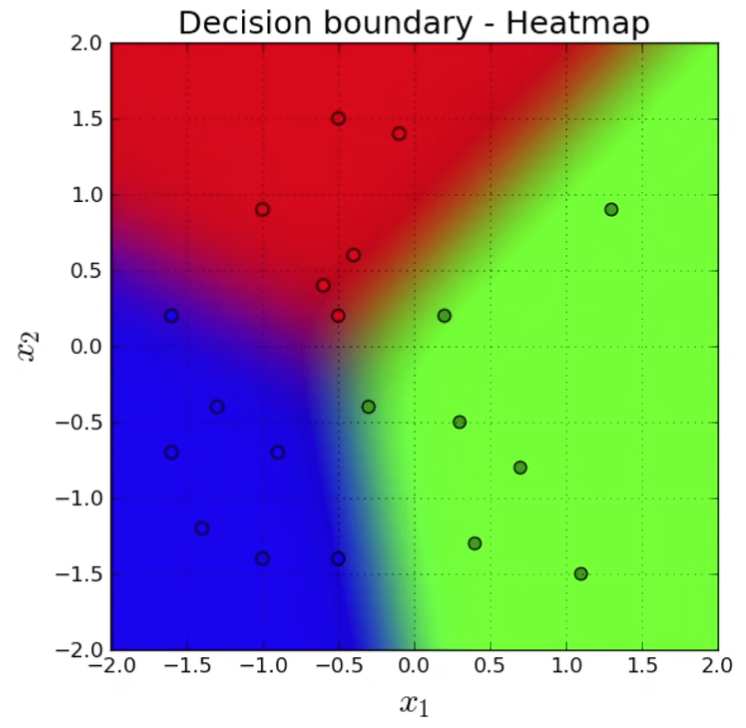

### 4.1.1 回归 VS 分类

- 回归估计一个连续值
- 分类预测一个离散类别
  
    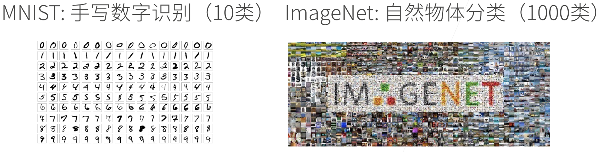
    

### 4.1.2 Kaggle上的分类问题

[将人类蛋白质显微镜图片分成28类](https://www.kaggle.com/c/human-protein-atlas-image-classification)

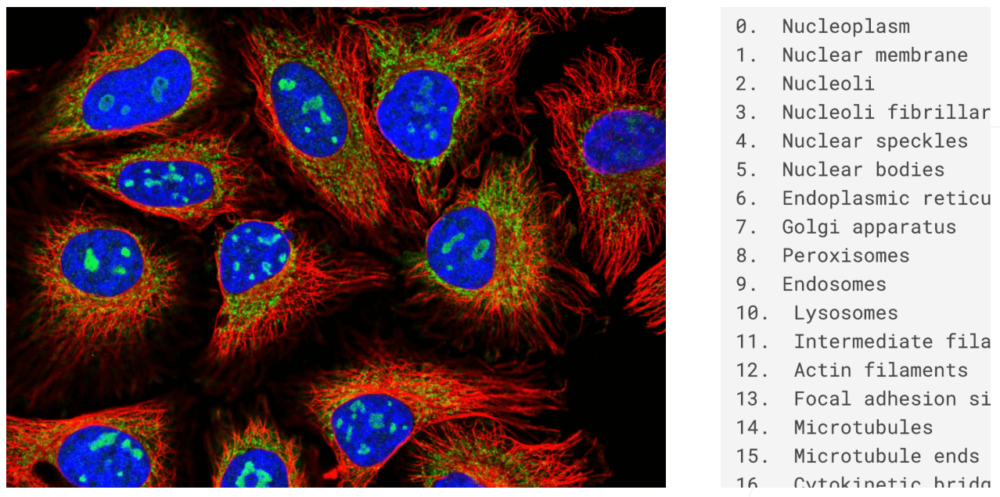

[将恶意软件分成4个类别](https://www.kaggle.com/c/malware-classification)


[将恶意的Wikipedia 评论分成7类](https://www.kaggle.com/c/jigsaw-toxic-comment-classification-challenge)

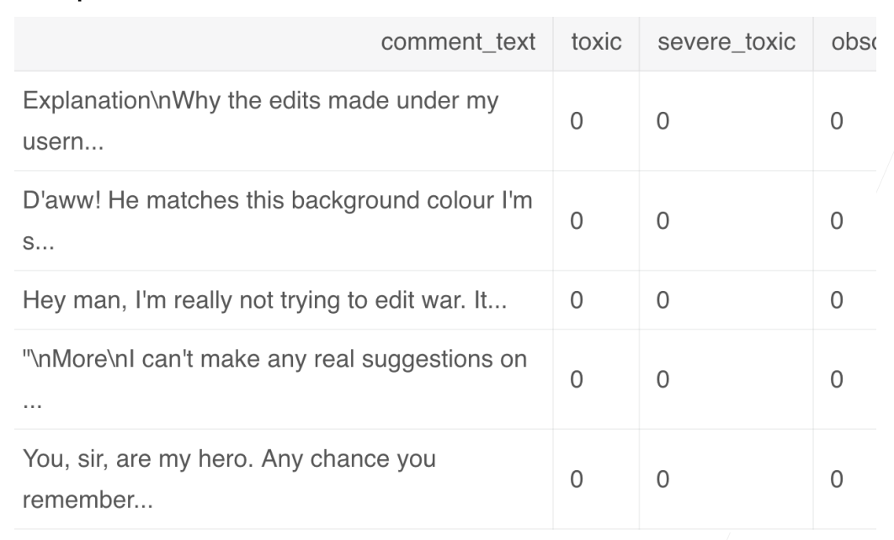

### 4.1.3 从回归到多类分类

#### 4.1.3.1 定义

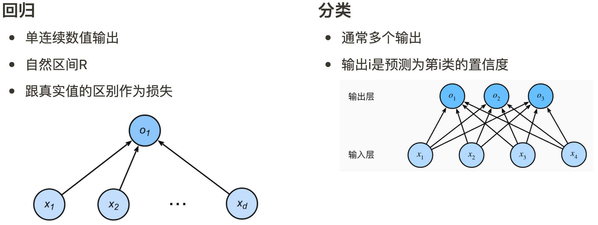

#### 4.1.3.2 均方损失

- 对类别进行一位有效编码
    - $y = [y_1, y_2, …, y_n]^T$
    - $y_i=\begin{cases}1& \text{if i = y}\\0& \text{otherwise}\end{cases}$
- 使用均方损失训练
- 最大值最为预测
  
    $\hat{y} = \mathop{argmax}\limits_{i}\ o_i$
    

#### 4.1.3.3 无校验比例

- 对类别进行一位有效编码
- 最大值最为预测
  
    $\hat{y} = \mathop{argmax}\limits_{i}\ o_i$
    
- 需要更置信的识别正确类(大余量)
  
    $o_y - o_i \geq \Delta(y,i)$
    

#### 4.1.3.4 校验比例

- 输出匹配概率(非负，和为1)
  
    (指数的好处是 不管是什么值 都能变成非负
    
    $\hat{y} = softmax(o)$
    
    $\hat{y_i} = \frac{exp(o_i)}{\mathop{\sum}\limits_{k}\ exp(o_k)}$
    
- 概率$y$和$\hat{y}$的区别作为损失

### 4.1.4 Softmax和交叉熵损失

- *交叉熵损失*(cross-entropy loss)常用来衡量两个概率的区别
  
    $H(p, q) = \mathop{\sum}\limits_{i}\ -p_ilog(q_i)$
    
- 将它作为损失
  
    $l(y, \hat{y}) = -  \mathop{\sum}\limits_{i}\ y_ilog\hat{y_i} = -log\ \hat{y_y}$
    
- 其梯度是真实概率和预测概率的区别
  
    $\partial_{oj}l(y, \hat{y}) = \frac{exp(o_j)}{\sum^q_{k=1}exp(o_k)}-y_j = softmax(o)_j - y_j$
    

## 4.2 损失函数

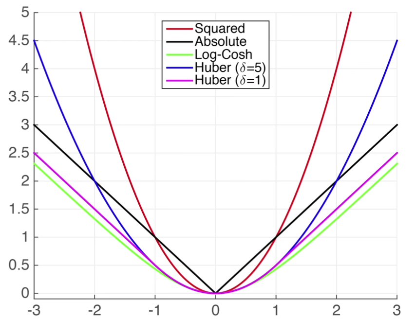

### 4.2.1 L2 Loss

$l(y,y^’) = \frac{1}{2}(y - y')^2$

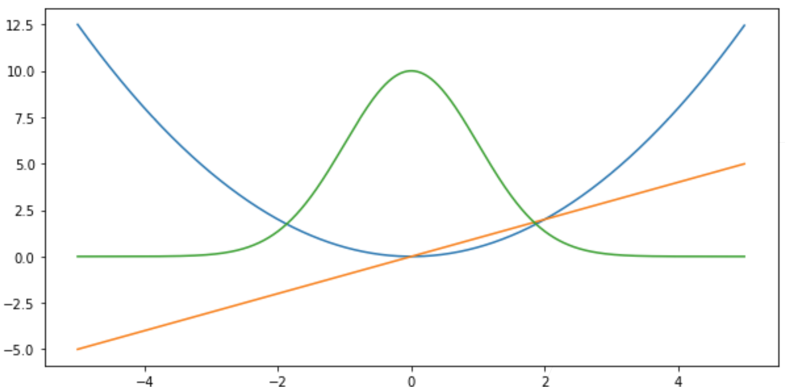

蓝色：$y=0$的时候，变化预测值$y^’$的函数

绿色：$l$的似然函数，$e^{-l}$，高斯函数

黄色：损失函数的梯度

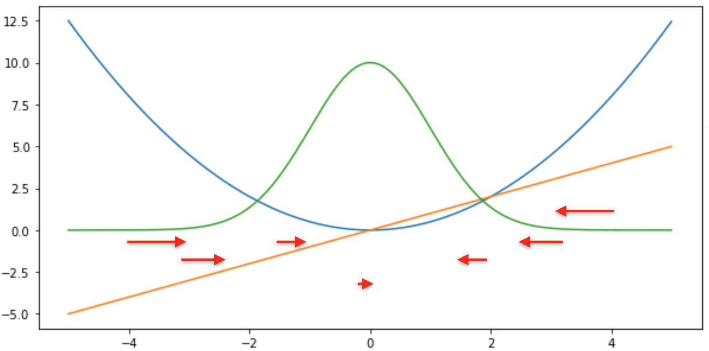

梯度下降的时候，是往负梯度方向更新参数，导数就决定怎么更新参数的

预测值$y^’$跟真实值$y$差的比较远的时候，梯度比较大，参数更新比较多，随着预测值慢慢靠近真实值的时候，靠近原点的时候，梯度绝对值变得越来越小，参数更新的幅度越来越小

(不是特别好的事情：当离原点比较远的值的时候，不一定想要那么大的梯度来更新参数，所以可以考虑绝对值损失函数L1 Loss

### 4.2.2 L1 Loss

$l(y,y^’)  = \lvert y - y^’ \rvert$


当真实值与预测值差别比较大的时候，不管多远，梯度都是常数，权重更新也不会很大，带来很多稳定性的好处

(缺点：零点处不可导，在零点处有-1到+1之间剧烈的变化，这个不平滑性导致预测值和真实值靠的比较近的时候，也就是当优化到末期的时候，这个地方会变得不那么稳定

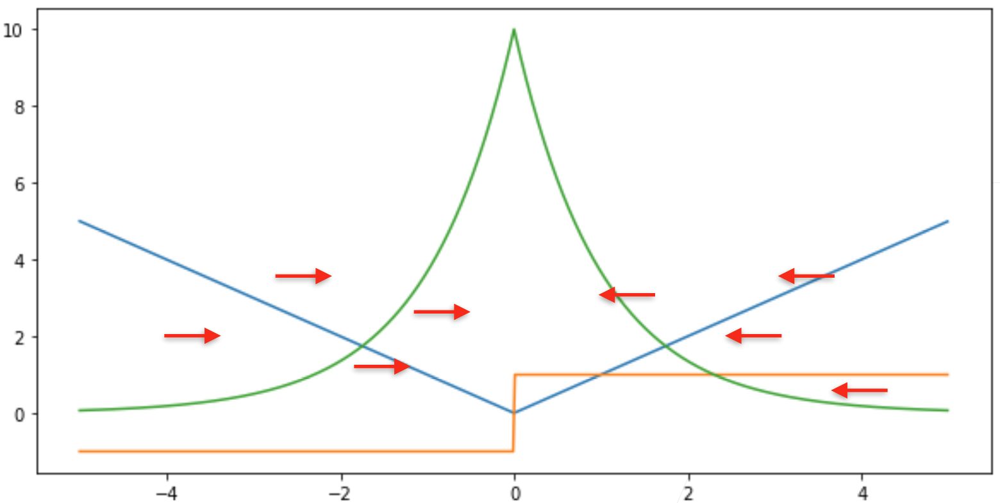

不管多远，梯度基本上是帮你以同样的力度往原点扯

### 4.2.3 Huber’ s Robust Loss

结合L1、L2的优点，避免他们的缺点

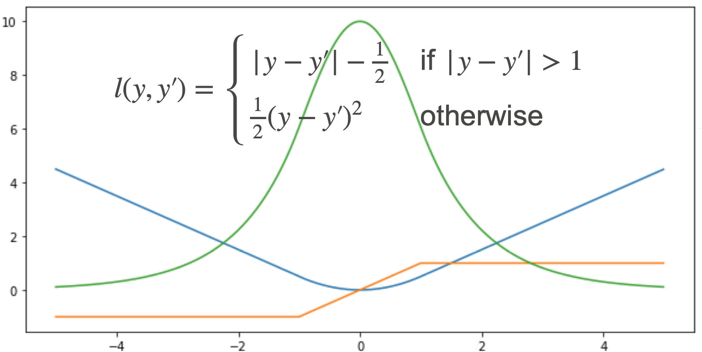

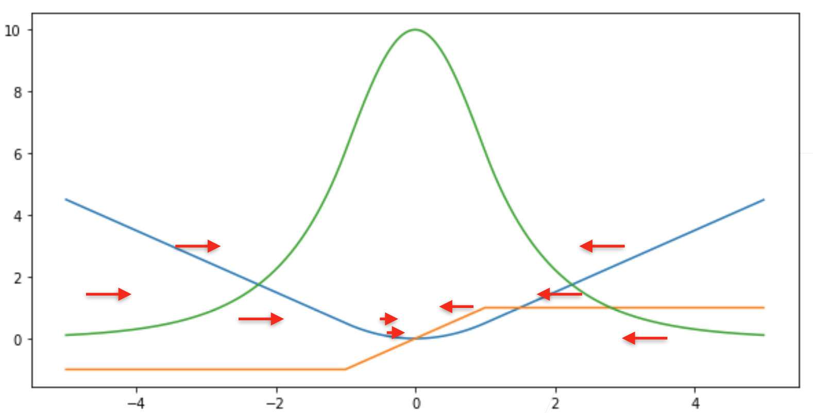

当预测值和真实值差的比较远的时候，均匀的力度拉，但靠近原点的时候，优化末期的时候，梯度的绝对值越来越小，保证优化比较平滑，而不会出现太多数值上的问题

## 4.3 图像分类数据集

MNIST是图像分类中广泛使用的数据集之一，但作为基准数据集过于简单。我们将使用类似但更复杂的Fashion-MNIST数据集

```python
%matplotlib inline
import torch
import torchvision # 用于视觉
from torch.utils import data
from torchvision import transforms # 对数据进行操作
from d2l import torch as d2l

d2l.use_svg_display() # svg显示图片
```

通过框架中的内置函数将 Fashion-MNIST 数据集下载并读取到内存中

```python
trans = transforms.ToTensor()
mnist_train = torchvision.datasets.FashionMNIST(
    root="../data", train=True, transform=trans, download=True)
mnist_test = torchvision.datasets.FashionMNIST(
    root="../data", train=False, transform=trans, download=True)
len(mnist_train),len(mnist_test)
mnist_train[0][0].shape # torch.Size([1,28,28]) 1是维度，28，28是长宽
```

两个可视化数据集的函数

```python
def get_fashion_mnist_labels(labels):  
    """返回Fashion-MNIST数据集的文本标签"""
    text_labels = ['t-shirt', 'trouser', 'pullover', 'dress', 'coat',
                   'sandal', 'shirt', 'sneaker', 'bag', 'ankle boot']
    return [text_labels[int(i)] for i in labels]

def show_images(imgs, num_rows, num_cols, titles=None, scale=1.5):  
    """绘制图像列表"""
    figsize = (num_cols * scale, num_rows * scale)
    _, axes = d2l.plt.subplots(num_rows, num_cols, figsize=figsize)
    axes = axes.flatten()
    for i, (ax, img) in enumerate(zip(axes, imgs)):
        if torch.is_tensor(img):
            ax.imshow(img.numpy())
        else:
            ax.imshow(img)
        ax.axes.get_xaxis().set_visible(False)
        ax.axes.get_yaxis().set_visible(False)
        if titles:
            ax.set_title(titles[i])
    return axes
```

几个样本的图像及其相应的标签

```python
X, y = next(iter(data.DataLoader(mnist_train, batch_size=18)))
show_images(X.reshape(18, 28, 28), 2, 4, titles=get_fashion_mnist_labels(y));
```

读取一小批量数据，大小为batch_size

```python
batch_size = 256

def get_dataloader_workers():  
    """使用4个进程来读取数据"""
    return 4
# test shuffle不用True了
train_iter = data.DataLoader(mnist_train, batch_size, shuffle=True,
                             num_workers=get_dataloader_workers())

timer = d2l.Timer()
# 循环一次跑一个Batch
for X, y in train_iter:
    continue
f'{timer.stop():.2f} sec'
```

定义load_data_fashion_mnist函数

```python
def load_data_fashion_mnist(batch_size, resize=None):  
    """下载Fashion-MNIST数据集，然后将其加载到内存中"""
    trans = [transforms.ToTensor()]
    if resize:
        trans.insert(0, transforms.Resize(resize))
    trans = transforms.Compose(trans)
    mnist_train = torchvision.datasets.FashionMNIST(
        root="../data", train=True, transform=trans, download=True)
    mnist_test = torchvision.datasets.FashionMNIST(
        root="../data", train=False, transform=trans, download=True)
    return (data.DataLoader(mnist_train, batch_size, shuffle=True,
                            num_workers=get_dataloader_workers()),
            data.DataLoader(mnist_test, batch_size, shuffle=False,
                            num_workers=get_dataloader_workers()))

train_iter, test_iter = load_data_fashion_mnist(32, resize=64)
for X, y in train_iter:
    print(X.shape, X.dtype, y.shape, y.dtype)
    break
```

## 4.4 Softmax回归的从零开始实现

```python
import torch
from IPython import display
from d2l import torch as d2l

batch_size = 256 # 每次随机读256张图片
train_iter, test_iter = d2l.load_data_fashion_mnist(batch_size)
```

将展平每个图像，将它们视为长度为784(28*28)的向量。因为我们的数据集有10个
类别，所以网络输出维度为 10

```python
num_inputs = 784 # softmax输入需要一维向量，损失空间信息
num_outputs = 10

W = torch.normal(0, 0.01, size=(num_inputs, num_outputs), requires_grad=True)
b = torch.zeros(num_outputs, requires_grad=True)
```

给定一个矩阵X，我们可以对所有元素求和

```python
X = torch.tensor([[1.0, 2.0, 3.0], [4.0, 5.0, 6.0]])
X.sum(0, keepdim=True), X.sum(1, keepdim=True)
```

- Output
  
    (tensor([[5., 7., 4.]]), tensor([[ 6.], [15.]]))
    

实现softmax

$softmax(X)_{ij} = \frac{exp(X_{ij})}{\sum_k exp(X_{ik})}$

```python
def softmax(X):
    X_exp = torch.exp(X)
    partition = X_exp.sum(1, keepdim=True) # 对每一行求和，输出还是二维矩阵
    return X_exp / partition # 这里应用了广播机制，矩阵中的每个元素/对应行元素之和
```

我们将每个元素变成一个非负数。此外，依据概率原理，每行总和为1

```python
X = torch.normal(0, 1, (2, 5))
X_prob = softmax(X)
X_prob, X_prob.sum(1)
```

- Output
  
    (tensor([[0.2468, 0.4115, 0.0445, 0.1603, 0.0368],[0.2128, 0.5422, 0.0865, 0.1104, 0.0481]]),
    tensor([1.0000, 1.0000]))
    

实现softmax回归模型

```python
def net(X):
  	# -1:电脑算一下，这里是batch size 
  	# X:reshape之后是256*784
    return softmax(torch.matmul(X.reshape((-1, W.shape[0])), W) + b)
```

创建一个数据y_hat，其中包含2个样本在3个类别的预测概率，使用y作为
y_hat 中概率的索引

```python
y = torch.tensor([0, 2])
# 分别是两个样本三类的预测值
y_hat = torch.tensor([[0.1, 0.3, 0.6], [0.3, 0.2, 0.5]])
y_hat[[0, 1], y]
# 对于样本把它对应真实标号的预测值拿出来
# [0,1]: 0相当于拿出来y0对应的值为0，即取y_hat[0][0]
# [0,1]: 1相当于拿出来y1对应的值为2，即取y_hat[1][2]
```

- Output
  
    tensor([0.1000, 0.5000])
    

实现交叉熵损失函数

```python
def cross_entropy(y_hat, y):
    return - torch.log(y_hat[range(len(y_hat)), y])

cross_entropy(y_hat, y)
```

- Output
  
    tensor([2.3026, 0.6431])
    

将预测类别与真实y元素进行比较

```python
def accuracy(y_hat, y):  
    """计算预测正确的数量"""
    if len(y_hat.shape) > 1 and y_hat.shape[1] > 1:
        y_hat = y_hat.argmax(axis=1)
    cmp = y_hat.type(y.dtype) == y
    return float(cmp.type(y.dtype).sum())

accuracy(y_hat, y) / len(y)
```

- Output
  
    0.5
    

可以评估在任意模型net的准确率

```python
def evaluate_accuracy(net, data_iter):  
    """计算在指定数据集上模型的精度"""
    if isinstance(net, torch.nn.Module):
        net.eval()
    metric = Accumulator(2)
    with torch.no_grad():
        for X, y in data_iter:
          	# y.numel() 样本总数
            metric.add(accuracy(net(X), y), y.numel())
    return metric[0] / metric[1]
```

Accumulator 实例中创建了2 个变量，用于分别存储正确预测的数量和预
测的总数量

```python
class Accumulator:  
    """在n个变量上累加"""
    def __init__(self, n):
        self.data = [0.0] * n

    def add(self, *args):
        self.data = [a + float(b) for a, b in zip(self.data, args)]

    def reset(self):
        self.data = [0.0] * len(self.data)

    def __getitem__(self, idx):
        return self.data[idx]

evaluate_accuracy(net, test_iter)
```

- Output
  
    0.1285
    

Softmax回归的训练

```python
def train_epoch_ch3(net, train_iter, loss, updater):  
    """训练模型一个迭代周期（定义见第3章）"""
    if isinstance(net, torch.nn.Module):
        net.train()
    metric = Accumulator(3)
    for X, y in train_iter:
        y_hat = net(X)
        l = loss(y_hat, y)
        if isinstance(updater, torch.optim.Optimizer):
            updater.zero_grad()
            l.mean().backward()
            updater.step()
        else:
            l.sum().backward()
            updater(X.shape[0])
        metric.add(float(l.sum()), accuracy(y_hat, y), y.numel())
    return metric[0] / metric[2], metric[1] / metric[2]
```

定义一个在动画中绘制数据的使用程序类

```python
class Animator:  
    """在动画中绘制数据"""
    def __init__(self, xlabel=None, ylabel=None, legend=None, xlim=None,
                 ylim=None, xscale='linear', yscale='linear',
                 fmts=('-', 'm--', 'g-.', 'r:'), nrows=1, ncols=1,
                 figsize=(3.5, 2.5)):
        if legend is None:
            legend = []
        d2l.use_svg_display()
        self.fig, self.axes = d2l.plt.subplots(nrows, ncols, figsize=figsize)
        if nrows * ncols == 1:
            self.axes = [self.axes, ]
        self.config_axes = lambda: d2l.set_axes(
            self.axes[0], xlabel, ylabel, xlim, ylim, xscale, yscale, legend)
        self.X, self.Y, self.fmts = None, None, fmts

    def add(self, x, y):
        if not hasattr(y, "__len__"):
            y = [y]
        n = len(y)
        if not hasattr(x, "__len__"):
            x = [x] * n
        if not self.X:
            self.X = [[] for _ in range(n)]
        if not self.Y:
            self.Y = [[] for _ in range(n)]
        for i, (a, b) in enumerate(zip(x, y)):
            if a is not None and b is not None:
                self.X[i].append(a)
                self.Y[i].append(b)
        self.axes[0].cla()
        for x, y, fmt in zip(self.X, self.Y, self.fmts):
            self.axes[0].plot(x, y, fmt)
        self.config_axes()
				display.display(self.fig)
        display.clear_output(wait=True)
```

训练函数

```python
def train_ch3(net, train_iter, test_iter, loss, num_epochs, updater):  
    """训练模型（定义见第3章）"""
    animator = Animator(xlabel='epoch', xlim=[1, num_epochs], ylim=[0.3, 0.4],
                        legend=['train loss', 'train acc', 'test acc'])
    for epoch in range(num_epochs):
        train_metrics = train_epoch_ch3(net, train_iter, loss, updater)
        test_acc = evaluate_accuracy(net, test_iter)
        animator.add(epoch + 1, train_metrics + (test_acc,))
    train_loss, train_acc = train_metrics
    assert train_loss < 0.5, train_loss
    assert train_acc <= 1 and train_acc > 0.7, train_acc
    assert test_acc <= 1 and test_acc > 0.7, test_acc
```

小批量随机梯度下降来优化模型的损失函数

```python
lr = 0.1

def updater(batch_size):
    return d2l.sgd([W, b], lr, batch_size)
```

训练模型10个迭代周期

```python
num_epochs = 10
train_ch3(net, train_iter, test_iter, cross_entropy, num_epochs, updater)
```

- Output
  
    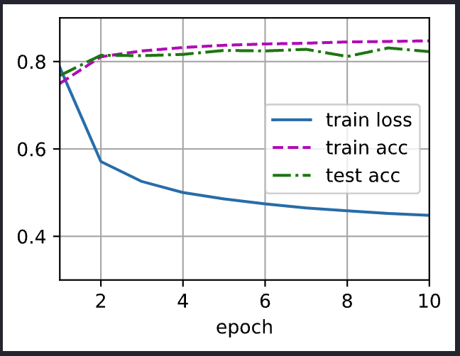
    

对图像进行分类预测

```python
def predict_ch3(net, test_iter, n=6):  
    """预测标签（定义见第3章）"""
    for X, y in test_iter:
        break
    trues = d2l.get_fashion_mnist_labels(y)
    preds = d2l.get_fashion_mnist_labels(net(X).argmax(axis=1))
    titles = [true +'\n' + pred for true, pred in zip(trues, preds)]
    d2l.show_images(
        X[0:n].reshape((n, 28, 28)), 1, n, titles=titles[0:n])

predict_ch3(net, test_iter)
```

- Output
  
    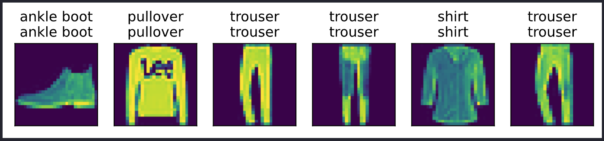
    

## 4.5 softmax回归的简洁实现

通过深度学习框架的高级API能够实现softmax回归变得更加容易

```python
import torch
from torch import nn
from d2l import torch as d2l

batch_size = 256
train_iter, test_iter = d2l.load_data_fashion_mnist(batch_size)
```

softmax回归的输出层是一个全连接层

```python
net = nn.Sequential(nn.Flatten(), nn.Linear(784, 10))

def init_weights(m):
    if type(m) == nn.Linear:
        nn.init.normal_(m.weight, std=0.01)

net.apply(init_weights);
```

在交叉熵损失函数中传递未归一化的预测，并同时计算softmax及其对数

```python
loss = nn.CrossEntropyLoss(reduction='none')
```

使用学习率为0.1的小批量随机梯度下降作为优化算法

```python
trainer = torch.optim.SGD(net.parameters(), lr=0.1)
```

调用之前定义的训练函数来训练模型

```python
num_epochs = 10
d2l.train_ch3(net, train_iter, test_iter, loss, num_epochs, trainer)
```

- Output
  
    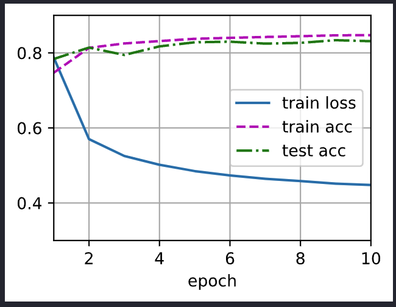