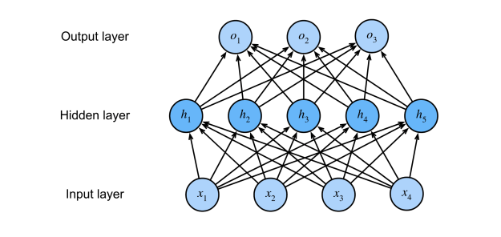

# 5 多层感知机

沐神视频讲解：[B站](https://www.bilibili.com/video/BV1hh411U7gn)

教材：[zh-v2.d2l.ai](https://zh-v2.d2l.ai/chapter_multilayer-perceptrons/mlp.html)

## 5.1 感知机

- 给定输入x，权重w，和偏移b，感知机输出：
  
    $o = \sigma (<w, x> + b)$
    
    $\partial(x) = \begin{cases} 1 & if 
    \ x  > 0 \\ -1 & otherwise \end{cases}$  
    
- 二分类：-1 或 1
    - Vs. 回归输出实数
    - Vs. Softmax回归输出概率

### 5.1.1 训练感知机

 y与<**w,x**>(预测值)相乘

**initialize** w = 0 and b = 0

**repeat**

​	**if**    $y_i[<w, x_i> + b] <= 0$ **then**

​			$w \leftarrow w + y_ix_i \ and \ b \leftarrow b + y_i$ 

​	**end if**

**until** all classified correctly

等价于使用批量大小为1的梯度下降，并使用如下的损失函数 $l(y,$ **x, w**$) = max(0, -y$<**w, x**>$)$

### 5.1.2 收敛定理

- 数据在半径r内
- 余量$\rho$分类两类
  
    $y$(**x**$^T$**w**$+b) \geq \rho$ 
    
    对于**||w||**$^2 + b^2 \leq 1$ 
    
- 感知机保证在$\frac{r^2+1}{\rho ^2}$步后收敛


### 5.1.3 XOR问题

感知机不能拟合XOR问题，它只能产生线性分割面


### 5.1.4 总结

- 感知机是一个二分类模型，是最早的AI模型之一
- 它的求解算法等价于使用batch size = 1的梯度下降
- 它不能拟合XOR函数，导致的第一次AI寒冬

## 5.2 多层感知机

`多层感知机`(multilayer perceptron)使用隐藏层和激活函数来得到非线性模型

### 5.2.1 学习XOR


### 5.2.2 单分类——单隐藏层

隐藏层大小是超参数

- 输入$x \in R^n$
- 隐藏层$W_1 \in R^{m * n}, b_1 \in R^m$
- 输出层$W_2 \in R^m, b_2 \in R$
  
    $h = \sigma(W_1x + b_1)$
    
    $o = W_2^Th + b_2$ 
    
    $\sigma$是按元素的`激活函数`(activation function)，为什么需要非线性激活函数？如果没有非线性的话，输出就是无限的线性函数套娃
    



### 5.2.3 激活函数

#### 5.2.3.1 ReLU激活函数

ReLU: `修正线性单元`(rectified linear unit)

$ReLU(x) = max(x, 0)$ 


> 当输入为负时，ReLU函数的导数为0，而当输入为正时，ReLU函数的导数为1。 注意，当输入值精确等于0时，ReLU函数不可导。 在此时，我们默认使用左侧的导数，即当输入为0时导数为0。 我们可以忽略这种情况，因为输入可能永远都不会是0。 这里引用一句古老的谚语，“如果微妙的边界条件很重要，我们很可能是在研究数学而非工程”， 这个观点正好适用于这里


> 使用ReLU的原因是，它求导表现得特别好：要么让参数消失，要么让参数通过。 这使得优化表现得更好，并且ReLU减轻了困扰以往神经网络的梯度消失问题（稍后将详细介绍）

#### 5.2.3.2 Sigmoid激活函数

sigmoid通常称为`挤压函数`(squashing function)将输入投影到(0, 1)，是一个软的

$\sigma(x) = y_i=\begin{cases}1& \text{if x > 0}\\0& \text{otherwise}\end{cases}$ 

$sigmoid(x) = \frac{1}{1 + e^{-x}}$ 


> 当我们想要将输出视作二元分类问题的概率时， sigmoid仍然被广泛用作输出单元上的激活函数 （sigmoid可以视为softmax的特例）。 然而，sigmoid在隐藏层中已经较少使用， 它在大部分时候被更简单、更容易训练的ReLU所取代
> 

#### 5.2.3.3 Tanh激活函数

将输入投影到(-1, 1)

$tanh(x) = \frac{1 - e^{-2x}}{1 + e^{-2x}}$


> 注意，当输入在0附近时，tanh函数接近线性变换。 函数的形状类似于sigmoid函数， 不同的是tanh函数关于坐标系原点中心对称
> 

### 5.2.4 多类分类——单隐藏层

$y_1, y_2, …, y_k = softmax(0_1, o_2, …, o_k)$ 

- 输入$x \in R^n$
- 隐藏层$W_1 \in R^{m * n}, b_1 \in R^m$
- 输出层$W_2 \in R^{m*k}, b_2 \in R$
  
    $h = \sigma(W_1x + b_1)$
    
    $o = W_2^Th + b_2$  
    
    $y = softmax(o)$
    


### 5.2.5 多隐藏层

$h_1 = \sigma(W_1x + b_1)$

$h_2 = \sigma(W_2h_1 + b_2)$

$h_3 = \sigma(W_3h_2 + b_3)$

$o = W_4h_3 + b_4$ 

超参数：隐藏层数、每层隐藏层的大小


## 5.3 多层感知机的从零实现

```python
import torch
from torch import nn
from d2l import torch as d2l

batch_size = 256
train_iter, test_iter = d2l.load_data_fashion_mnist(batch_size)
```

实现一个具有单隐藏层的多层感知机，它包含256个隐藏单元

```python
num_inputs, num_outputs, num_hiddens = 784, 5, 256

W1 = nn.Parameter(torch.randn(
    num_inputs, num_hiddens, requires_grad=True) * 0.01)
b1 = nn.Parameter(torch.zeros(num_hiddens, requires_grad=True))
W2 = nn.Parameter(torch.randn(
    num_hiddens, num_outputs, requires_grad=True) * 0.01)
b2 = nn.Parameter(torch.zeros(num_outputs, requires_grad=True))

params = [W1, b1, W2, b2]
```

实现ReLU激活函数

```python
def relu(X):
    a = torch.zeros_like(X)
    return torch.max(X, a)
```

实现模型

```python
def net(X):
    X = X.reshape((-1, num_inputs))
    H = relu(X @ W1 + b1)
    return (H @ W2 + b2)

loss = nn.CrossEntropyLoss(reduction='none')
```

多层感知机的训练过程与softmax回归的训练过程完全相同

```python
num_epochs, lr = 5, 0.1
updater = torch.optim.SGD(params, lr=lr)
d2l.train_ch3(net, train_iter, test_iter, loss, num_epochs, updater)
```

- Output
  
    
    

在一些测试数据上应用这个模型

```python
d2l.predict_ch3(net, test_iter)
```

- Output
  
    
    

## 5.4 多层感知机的简洁实现

高级API

```python
import torch
from torch import nn
from d2l import torch as d2l
```

隐藏层包含256个隐藏单元，并使用了ReLU激活函数

```python
net = nn.Sequential(nn.Flatten(),
                    nn.Linear(784, 256),
                    nn.ReLU(),
                    nn.Linear(256, 5))

def init_weights(m):
    if type(m) == nn.Linear:
        nn.init.normal_(m.weight, std=0.01)

net.apply(init_weights);
```

训练过程

```python
batch_size, lr, num_epochs = 256, 0.1, 5
loss = nn.CrossEntropyLoss(reduction='none')
trainer = torch.optim.SGD(net.parameters(), lr=lr)

train_iter, test_iter = d2l.load_data_fashion_mnist(batch_size)
d2l.train_ch3(net, train_iter, test_iter, loss, num_epochs, trainer)
```

- Output
  
    