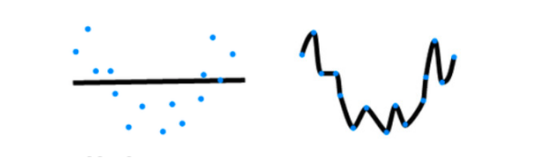

# 6 模型选择+过拟合和欠拟合

沐神视频讲解：[B站](https://www.bilibili.com/video/BV1kX4y1g7jp)

教材：[zh-v2.d2l.ai](https://zh-v2.d2l.ai/chapter_multilayer-perceptrons/underfit-overfit.html)

我们的目标是发现某些模式， 这些模式捕捉到了我们训练集潜在总体的规律。 如果成功做到了这点，即使是对以前从未遇到过的个体， 模型也可以成功地评估风险。 如何发现可以泛化的模式是机器学习的根本问题

困难在于，当我们训练模型时，我们只能访问数据中的小部分样本。 最大的公开图像数据集包含大约一百万张图像。 而在大部分时候，我们只能从数千或数万个数据样本中学习。 在大型医院系统中，我们可能会访问数十万份医疗记录。 当我们使用有限的样本时，可能会遇到这样的问题： 当收集到更多的数据时，会发现之前找到的明显关系并不成立

## 6.1 训练误差和泛化误差

- `训练误差`(training error)：模型在训练数据上的误差
- `泛化误差`(generalization error)：模型在新数据上的误差
- 例子：根据模考成绩来预测未来考试分数
    - 在过去的考试中表现得很好（训练误差）不代表未来考试一定会好（泛化误差）
    - 学生A通过背书在模考中拿到很好成绩
    - 学生B知道答案后面的原因

> 问题是，我们永远不能准确地计算出泛化误差。 这是因为无限多的数据样本是一个虚构的对象。 在实际中，我们只能通过将模型应用于一个独立的测试集来估计泛化误差， 该测试集由随机选取的、未曾在训练集中出现的数据样本构成
> 

### 6.1.1 统计学习理论

监督学习情景中， 我们假设训练数据和测试数据都是从相同的分布中独立提取的。 这通常被称为`独立同分布假设`(i.i.d. assumption)， 这意味着对数据进行采样的过程没有进行“记忆”。 换句话说，抽取的第2个样本和第3个样本的相关性， 并不比抽取的第2个样本和第200万个样本的相关性更强

要成为一名优秀的机器学习科学家需要具备批判性思考能力。 假设是存在漏洞的，即很容易找出假设失效的情况。 如果我们根据从加州大学旧金山分校医学中心的患者数据训练死亡风险预测模型， 并将其应用于马萨诸塞州综合医院的患者数据，结果会怎么样？ 这两个数据的分布可能不完全一样。 此外，抽样过程可能与时间有关。 比如当我们对微博的主题进行分类时， 新闻周期会使得正在讨论的话题产生时间依赖性，从而违反独立性假设

有时候我们即使轻微违背独立同分布假设，模型仍将继续运行得非常好。 比如，我们有许多有用的工具已经应用于现实，如人脸识别、语音识别和语言翻译。 毕竟，几乎所有现实的应用都至少涉及到一些违背独立同分布假设的情况

有些违背独立同分布假设的行为肯定会带来麻烦。 比如，我们试图只用来自大学生的人脸数据来训练一个人脸识别系统， 然后想要用它来监测疗养院中的老人。 这不太可能有效，因为大学生看起来往往与老年人有很大的不同

在接下来的章节中，我们将讨论因违背独立同分布假设而引起的问题。 目前，即使认为独立同分布假设是理所当然的，理解泛化性也是一个困难的问题。 此外，能够解释深层神经网络泛化性能的理论基础， 也仍在继续困扰着学习理论领域最伟大的学者们

当我们训练模型时，我们试图找到一个能够尽可能拟合训练数据的函数。 但是如果它执行地“太好了”，而不能对看不见的数据做到很好泛化，就会导致过拟合。 这种情况正是我们想要避免或控制的。 深度学习中有许多启发式的技术旨在防止过拟合

### 6.1.2 模型复杂性

当我们有简单的模型和大量的数据时，我们期望泛化误差与训练误差相近。 当我们有更复杂的模型和更少的样本时，我们预计训练误差会下降，但泛化误差会增大。 模型复杂性由什么构成是一个复杂的问题。 一个模型是否能很好地泛化取决于很多因素。 例如，具有更多参数的模型可能被认为更复杂， 参数有更大取值范围的模型可能更为复杂。 通常对于神经网络，我们认为需要更多训练迭代的模型比较复杂， 而需要`早停`(early stopping)的模型（即较少训练迭代周期）就不那么复杂

我们很难比较本质上不同大类的模型之间（例如，决策树与神经网络）的复杂性。 就目前而言，一条简单的经验法则相当有用： 统计学家认为，能够轻松解释任意事实的模型是复杂的， 而表达能力有限但仍能很好地解释数据的模型可能更有现实用途。 在哲学上，这与波普尔的科学理论的可证伪性标准密切相关： 如果一个理论能拟合数据，且有具体的测试可以用来证明它是错误的，那么它就是好的。 这一点很重要，因为所有的统计估计都是`事后归纳`。 也就是说，我们在观察事实之后进行估计，因此容易受到相关谬误的影响。 目前，我们将把哲学放在一边，坚持更切实的问题

本节为了给出一些直观的印象，我们将重点介绍几个倾向于影响模型泛化的因素

1. 可调整参数的数量。当可调整参数的数量（有时称为`自由度`）很大时，模型往往更容易过拟合
2. 参数采用的值。当权重的取值范围较大时，模型可能更容易过拟合
3. 训练样本的数量。即使模型很简单，也很容易过拟合只包含一两个样本的数据集。而过拟合一个有数百万个样本的数据集则需要一个极其灵活的模型

## 6.2 模型选择

在机器学习中，我们通常在评估几个候选模型后选择最终的模型。 这个过程叫做`模型选择`。 有时，需要进行比较的模型在本质上是完全不同的（比如，决策树与线性模型）。 又有时，我们需要比较不同的超参数设置下的同一类模型，为了确定候选模型中的最佳模型，我们通常会使用验证集

### 6.2.1 验证数据集和测试数据集

虽然理想情况下我们只会使用测试数据一次， 以评估最好的模型或比较一些模型效果，但现实是测试数据很少在使用一次后被丢弃。 我们很少能有充足的数据来对每一轮实验采用全新测试集

解决此问题的常见做法将数据集分为训练集、验证集、测试集，但现实是验证数据和测试数据之间的边界模糊得令人担忧。 除非另有明确说明，否则在这本书的实验中， 我们实际上是在使用应该被正确地称为训练数据和验证数据的数据集， 并没有真正的测试数据集。 因此，书中每次实验报告的准确度都是验证集准确度，而不是测试集准确度

- 验证数据集(validation dataset)：一个用来评估模型好坏的数据集（选择模型超参数
    - 例如拿出50%的训练数据
    - 不要跟训练数据混在一起（常犯错误）
- 测试数据集：只用一次的数据集。例如
    - 未来的考试
    - 我出价的房子的实际成交价
    - 用在Kaggle私有排行榜中的数据集

### 6.2.2 K-折交叉验证

当训练数据稀缺时，我们甚至可能无法提供足够的数据来构成一个合适的验证集。 这个问题的一个流行的解决方案是采用`K折交叉验证`，原始训练数据被分成K个不重叠的子集，然后执行K次模型训练和验证，每次在K−1个子集上进行训练， 并在剩余的一个子集（在该轮中没有用于训练的子集）上进行验证，最后，通过对K次实验的结果取平均来估计训练和验证误差

- 在没有足够多数据时使用（这是常态）
- 算法：
    - 将训练数据分割成K块
    - for i = 1, …, K
        - 使用第i块作为验证数据集，其余的作为训练数据集
    - 报告K个验证集误差的平均
- 常用：K = 5 或 10

第一种是确定超参数，然后用这个超参数训练一遍全部数据

第二种是取一折里的参数作为模型的参数，缺点是少看了数据集

第三种是将K折的模型全部拿下来，然后那测试集在上面都跑一遍，把预测结果取均值，缺点是预测代价变成K倍，优点是增加了模型的稳定性

## 6.3 过拟合与欠拟合


当我们比较训练和验证误差时，要注意两种常见的情况。 第一种：训练误差和验证误差都很严重， 但它们之间仅有一点差距。 如果模型不能降低训练误差，这可能意味着模型过于简单（即表达能力不足）， 无法捕获试图学习的模式。 此外，由于我们的训练和验证误差之间的*泛化误差*很小， 我们有理由相信可以用一个更复杂的模型降低训练误差。 这种现象被称为`欠拟合`(underfitting)

另一方面，`过拟合`(overfitting)为模型在训练数据上拟合的比在潜在分布中更接近的现象，当训练误差明显低于验证误差时表明严重的`过拟合`(overfitting)，注意，`过拟合`并不总是一件坏事。 特别是在深度学习领域，众所周知， 最好的预测模型在训练数据上的表现往往比在保留（验证）数据上好得多。 最终，我们通常更关心验证误差，而不是训练误差和验证误差之间的差距

在实验中调整模型架构或超参数时会发现： 如果有足够多的神经元、层数和训练迭代周期， 模型最终可以在训练集上达到完美的精度，此时测试集的准确性却下降了

用于对抗过拟合的技术称为`正则化`(regularization)

是否过拟合或欠拟合可能取决于模型复杂性和可用训练数据集的大小

### 6.3.1 模型复杂性

高阶多项式函数比低阶多项式函数复杂得多。 高阶多项式的参数较多，模型函数的选择范围较广。 因此在固定训练数据集的情况下， 高阶多项式函数相对于低阶多项式的训练误差应该始终更低（最坏也是相等）。 事实上，当数据样本包含了$x$的不同值时， 函数阶数等于数据样本数量的多项式函数可以完美拟合训练集。 在下图中， 我们直观地描述了多项式的阶数和欠拟合与过拟合之间的关系

红色的箭头线的gap通常用来衡量过拟合和欠拟合的程度

模型容量要足够大，然后控制容量不过拟合，泛化误差又能往下降


#### 6.3.1.1 模型容量

- 拟合各种函数的能力
- 低容量的模型难以拟合训练数据
- 高容量的模型可以记住所有的训练数据
  
    
    

#### 6.3.1.2 估计模型容量

- 难以在不同的种类算法之间比较
    - 例如数模型和神经网络
- 给定一个模型种类，将有两个主要元素
    - 参数的个数
    - 参数值的选择范围
      
        
        

### 6.3.2 数据集大小

训练数据集中的样本越少，我们就越有可能（且更严重地）过拟合。 随着训练数据量的增加，泛化误差通常会减小。 此外，一般来说，更多的数据不会有什么坏处。 对于固定的任务和数据分布，模型复杂性和数据集大小之间通常存在关系。 给出更多的数据，我们可能会尝试拟合一个更复杂的模型。 能够拟合更复杂的模型可能是有益的。 如果没有足够的数据，简单的模型可能更有用。 对于许多任务，深度学习只有在有数千个训练样本时才优于线性模型。 从一定程度上来说，深度学习目前的生机要归功于 廉价存储、互联设备以及数字化经济带来的海量数据集

#### 数据复杂度

- 多个重要因素
    - 样本个数
    - 每个样本的元素个数
    - 时间、空间结构
    - 多样性

## 6.4 VC维

- 统计学习理论的一个核心思想
- 对于一个分类模型，VC等于一个最大的数据集的大小，不管如何给定标号，都存在一个模型来对它进行完美分类


### 6.4.1 线性分类器的VC维

- 2维输入的感知机，VC维 = 3
  
    - 能够分类任何三个点，但不是4个(xor)
      
        
    
- 支持N维输入的感知机的VC维是N + 1
- 一些多层感知机的VC维$O(Nlog_2N)$

### 6.4.2 VC维的用处

- 提供为什么一个模型好的理论依据
    - 它可以衡量训练误差和泛化误差之间的间隔
- 但深度学习中很少使用
    - 衡量不是很准确
    - 计算深度学习模型的VC维很困难

## 6.5 总结

- 模型容量需要匹配数据复杂度，否则可能导致欠拟合和过拟合
- 统计机器学习提供数学工具来衡量模型复杂度
- 实际中一般靠观察训练误差和验证误差

## 6.6 实现代码

### 6.6.1 生成数据集

使用以下三阶多项式来生成训练和测试数据的标签：

$y = 5 + 1.2x - 3.4\frac{x^2}{2!} + 5.6\frac{x^3}{3!} + \epsilon \ where \ \epsilon ~ \Nu (0, 0.1^2)$

噪声项$\epsilon$服从均值为0且标准差为0.1的正态分布。在优化的过程中，我们通常希望避免非常大的梯度值或损失值。 这就是我们将特征从$x^i$调整为$\frac{x^i}{i!}$的原因， 这样可以避免很大的$i$带来的特别大的指数值。 我们将为训练集和测试集各生成100个样本

```python
max_degree = 20 # 多项式的最大阶数
n_train, n_test = 100, 100 # 训练和测试数据集大小
true_w = np.zeros(max_degree) # 分配大量的空间
true_w[0:4] = np.array([5, 1.2, -3.4, 5.6])

features = np.random.normal(size=(n_train + n_test, 1))
np.random.shuffle(features)
poly_features = np.power(features, np.arange(max_degree).reshape(1, -1))
for i in range(max_degree):
    poly_features[:, i] /= math.gamma(i + 1) # gamma(n)=(n-1)!

# labels的维度:(n_train+n_test,)
labels = np.dot(poly_features, true_w)
labels += np.random.normal(scale=0.1, size=labels.shape)
```

查看一下前两个样本

```python
true_w, features, poly_features, labels = [torch.tensor(x, dtype=
    torch.float32) for x in [true_w, features, poly_features, labels]]

features[:2], poly_features[:2, :], labels[:2]
```

- Output
  
    (tensor([[-0.7408], [ 0.9021]]), 
    
    tensor([[ 1.0000e+00, -7.4078e-01,  2.7438e-01, -6.7751e-02,  1.2547e-02, -1.8589e-03,  2.2951e-04, -2.4288e-05,  2.2490e-06, -1.856e-07, 1.3713e-08, -9.2346e-10,  5.7007e-6, -3.2484e-12,  1.7188e-13, -8.4884e-15, 3.9300e-16, -1.7125e-17,  7.0478e-19, -2.7478e-20],
    [ 1.0000e+00,  9.0208e-01,  4.0687e-01,  1.2234e-01,  2.7591e-02, 4.9777e-03,  7.4838e-04,  9.6443e-05,  1.0875e-05,  1.0900e-06, 9.8325e-08, 8.0633e-09,  6.0614e-10,  4.2061e-6,  2.7101e-12, 1.6298e-13,  9.1889e-15, 4.8759e-16,  2.4436e-17,  1.1602e-18]]), 
    
    tensor([2.9074, 5.2200]))
    

### 6.6.2 对模型进行训练和测试

实现一个函数来评估模型在给定数据集上的损失

```python
def evaluate_loss(net, data_iter, loss):  
    """评估给定数据集上模型的损失"""
    metric = d2l.Accumulator(2) # 损失的总和,样本数量
    for X, y in data_iter:
        out = net(X)
        y = y.reshape(out.shape)
        l = loss(out, y)
        metric.add(l.sum(), l.numel())
    return metric[0] / metric[1]
```

定义训练函数

```python
def train(train_features, test_features, train_labels, test_labels,
          num_epochs=400):
    loss = nn.MSELoss(reduction='none')
    input_shape = train_features.shape[-1]
		# 不设置偏置，因为我们已经在多项式中实现了它
    net = nn.Sequential(nn.Linear(input_shape, 1, bias=False))
    batch_size = min(10, train_labels.shape[0])
    train_iter = d2l.load_array((train_features, train_labels.reshape(-1,1)),
                                batch_size)
    test_iter = d2l.load_array((test_features, test_labels.reshape(-1,1)),
                               batch_size, is_train=False)
    trainer = torch.optim.SGD(net.parameters(), lr=0.01)
    animator = d2l.Animator(xlabel='epoch', ylabel='loss', yscale='log',
                            xlim=[1, num_epochs], ylim=[1e-3, 1e2],
                            legend=['train', 'test'])
    for epoch in range(num_epochs):
        d2l.train_epoch_ch3(net, train_iter, loss, trainer)
        if epoch == 0 or (epoch + 1) % 20 == 0:
            animator.add(epoch + 1, (evaluate_loss(net, train_iter, loss),
                                     evaluate_loss(net, test_iter, loss)))
    print('weight:', net[0].weight.data.numpy())
```

### 6.6.3 三阶多项式函数拟合(正常)

我们将首先使用三阶多项式函数，它与数据生成函数的阶数相同。 结果表明，该模型能有效降低训练损失和测试损失。 学习到的模型参数也接近真实值$w = [5, 1.2, -3.4, 5.6]$

```python
# 从多项式特征中选择前4个维度，即1,x,x^2/2!,x^3/3!
train(poly_features[:n_train, :4], poly_features[n_train:, :4],
      labels[:n_train], labels[n_train:])
```

- Output
  
    weight: [[ 5.000446 1.1925726 -3.3994446 5.613429 ]]
    
    
    

### 6.6.4 线性函数拟合(欠拟合)

让我们再看看线性函数拟合，减少该模型的训练损失相对困难。 在最后一个迭代周期完成后，训练损失仍然很高。 当用来拟合非线性模式（如这里的三阶多项式函数）时，线性模型容易欠拟合

```python
# 从多项式特征中选择前2个维度，即1和x
train(poly_features[:n_train, :2], poly_features[n_train:, :2],
      labels[:n_train], labels[n_train:])
```

- Output
  
    weight: [[3.3861537 3.623168 ]]
    
    
    

### 6.6.5 高阶多项式函数拟合(过拟合)

```python
# 从多项式特征中选取所有维度
train(poly_features[:n_train, :], poly_features[n_train:, :],
      labels[:n_train], labels[n_train:], num_epochs=1500)
```

- Output
  
    weight: [[ 4.976002    1.2835668  -3.2593832   5.150967   -0.41944516  1.348935 -0.17952554  0.15169154 -0.15447472  0.15434313  0.6540707 -0.20328848 0.20229222 -0.19785015 -0.13074256 -0.16738276 0.03405237 -0.03323355 -0.08506632  0.14969553]]
    
    