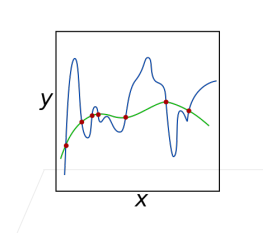
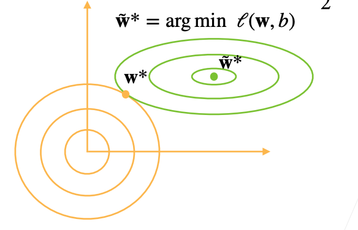
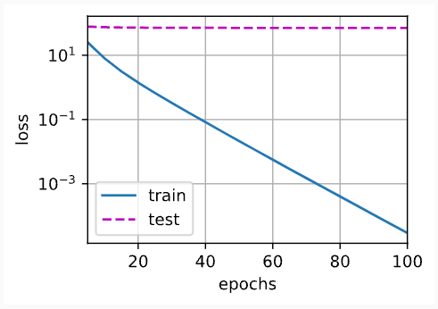
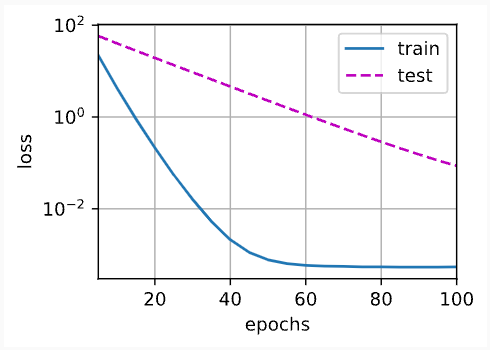
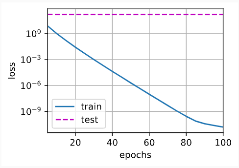
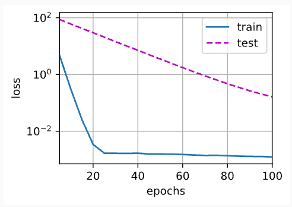

# 7 权重衰减

沐神视频讲解：[B站](https://www.bilibili.com/video/BV1UK4y1o7dy)

教材：[zh-v2.d2l.ai](https://zh-v2.d2l.ai/chapter_multilayer-perceptrons/weight-decay.html)

前一节我们描述了过拟合的问题，本节我们将介绍一些正则化模型的技术。 我们总是可以通过去收集更多的训练数据来缓解过拟合。 但这可能成本很高，耗时颇多，或者完全超出我们的控制，因而在短期内不可能做到。 假设我们已经拥有尽可能多的高质量数据，我们便可以将重点放在正则化技术上

我们可以通过调整拟合多项式的阶数来限制模型的容量。 实际上，限制特征的数量是缓解过拟合的一种常用技术。 然而，简单地丢弃特征对这项工作来说可能过于生硬，可能仍然使模型在过简单和过复杂中徘徊， 我们需要一个更细粒度的工具来调整函数的复杂性，使其达到一个合适的平衡位置

## 7.1 理论

`权重衰减`(weight decay)就是一种处理过拟合的常见方法，通常也被称为$`L_2$正则化`

> 这项技术通过函数与零的距离来衡量函数的复杂度， 因为在所有函数$f$中，函数$f=0$(所有输入都得到值0)在某种意义上是最简单的，但是我们应该如何精确地测量一个函数和零之间的距离呢？
> 

一种简单的方法是通过线性函数$f(x) = w^Tx$中的权重向量的某个范数来度量其复杂性，例如$||w||^2$。要保证权重向量比较小，最常用方法是将其范数作为惩罚项加到最小化损失的问题中，将原来的训练目标`最小化训练标签上的预测损失`，调整为`最小化预测损失和惩罚项之和`。现在，如果我们的权重向量增长的太大，学习算法可能会更集中于最小化权重范数$||w||^2$。这正是我们想要的。

> 损失为$L(w, b) = \frac{1}{n} \sum\limits ^n_{i=1} \frac{1}{2} \left(w^Tx^{(i)} + b - y^{(i)}\right)^2$，为了惩罚权重向量的大小，必须以某种方式在损失函数中添加$||w||^2$，但是模型应该如何平衡这个新的额外惩罚的损失？
> 

实际上，通过`正则化常数`$\lambda$来描述这种平衡，这是一个非负超参数，使用验证数据拟合：$L(w, b) + \frac{\lambda}{2}||w||^2$ ，对于$\lambda = 0$，恢复了原来的损失函数；对于$\lambda > 0$，限制||w||的大小

> 为什么要除以2？
> 

当我们取一个二次函数的导数时，2和$\frac{1}{2}$ 会抵消，以确保更新表达式看起来既漂亮又简单

> 为什么在这里使用平方范数而不是标准范数（即欧几里得距离）？
> 

为了便于计算。 通过平方$L2$范数，我们去掉平方根，留下权重向量每个分量的平方和。 这使得惩罚的导数很容易计算：导数的和等于和的导数

> 为什么我们首先使用$L2$范数，而不是$L1$范数? （在[书中这一节](https://zh-v2.d2l.ai/chapter_preliminaries/linear-algebra.html#subsec-lin-algebra-norms)已经描述了$L_2$范数和$L_1$范数，它们是更为一般的$L_p$范数的特殊情况
> 

事实上，这个选择在整个统计领域中都是有效的和受欢迎的。$L2$正则化线性模型构成经典的`岭回归`(ridge regression)算法，$L1$正则化线性回归是统计学中类似的基本模型， 通常被称为`套索回归`(lasso regression)

使用$L2$范数的一个原因是它对权重向量的大分量施加了巨大的惩罚。 这使得我们的学习算法偏向于在大量特征上均匀分布权重的模型。 在实践中，这可能使它们对单个变量中的观测误差更为稳定。 相比之下，$L1$惩罚会导致模型将权重集中在一小部分特征上， 而将其他权重清除为零。 这称为`特征选择`(feature selection)，这可能是其他场景下需要的

### 7.1.1使用均方范数作为硬性限制

- 通过限制参数值的选择范围来控制模型容量
    - 通常不限制偏移b（限不限制都差不多）
      
        $min \ l(w, b) \ subject \ to \ ||w||^2 ≤ \theta$
        
    - 小的$\theta$ 意味着更强的正则项
    
    
    

### 7.1.2 使用均方范数作为柔性限制

（常用

增加lambda来让模型不要那么复杂

- 对每个$\theta$，都可以找到$\lambda$使得之前的目标函数等价于下面
  
    $min \ l(w, b) + \frac{\lambda}{2} ||w||^2$ 
    
    - 可以通过拉格朗日乘子来证明
- 超参数$\lambda$控制了正则项的重要程度
    - $\lambda = 0$ : 无作用
    - $\lambda \rightarrow ∞，w^* \rightarrow 0$

### 7.1.3 演示对最优解的影响

$w^* = argmin \ l(w, b) + \frac{\lambda}{2}||w||^2$

$w^* = argmin \ l(w, b)$ 



### 7.1.4 参数更新法则

$L2$正则化回归

- 计算梯度
  
    $\frac{\partial}{\partial{w}} \left(l(w, b) + \frac{\lambda}{2}||w||^2\right) = \frac{\partial{l(w, b)}}{\partial{w}} + \lambda w$
    
- 时间t更新参数
  
    $w_{t+1} = (1-\eta\lambda)w_t - \eta\frac{\partial{l(w_t, b_t)}}{\partial{w_t}}$
    
    - 通常$\eta\lambda < 1$，在深度学习中通常叫做权重衰退
- 小批量随机梯度下降更新如下：
  
    $w \leftarrow (1 - \eta\lambda)w - \frac{\eta}{|B|}\sum\limits_{i \in B} x^{(i)} \left(w^Tx^{(i)} + b - y^{(i)} \right)$ 
    

根据估计值与观测值之间的差异来更新w，然而，同时也在试图将w的大小缩小到0，这就是为啥这种方法有时候被称为`权重衰减`。我们仅考虑惩罚项，优化算法在训练的每一步`衰减`权重。与特征选择相比，权重衰减为我们提供了一种连续的机制来调整函数的复杂度，较小的$\lambda$值对应较少约束的$w$，而较大的$\lambda$值对$w$的约束更大

是否对相应的偏置$b^2$进行惩罚在不同的实践中会有所不同，在神经网络的不同层中也会有所不同，通常，网络输出层的偏置项不会被正则化

## 7.2 高维线性回归

通过一个简单的例子来演示权重衰减

```python
%matplotlib inline
import torch
from torch import nn
from d2l import torch as d2l
```

首先，像以前一样生成一些数据，生成公式如下：

$y = 0.05 + \sum\limits_{i=1}^d0.01x_i + \epsilon \ where \ \epsilon \ ~ N(0, 0.01^2)$ 

我们选择标签是关于输入的线性函数。 标签同时被均值为0，标准差为0.01高斯噪声破坏。 为了使过拟合的效果更加明显，我们可以将问题的维数增加到$d = 200$， 并使用一个只包含20个样本的小训练集

```python
n_train, n_test, num_inputs, batch_size = 20, 100, 200, 5
true_w, true_b = torch.ones((num_inputs, 1)) * 0.01, 0.05
train_data = d2l.synthetic_data(true_w, true_b, n_train)
train_iter = d2l.load_array(train_data, batch_size)
test_data = d2l.synthetic_data(true_w, true_b, n_test)
test_iter = d2l.load_array(test_data, batch_size, is_train=False)
```

## 7.3 从零开始实现

从头开始实现权重衰减，只需将$L2$的平方惩罚添加到原始目标函数中

### 7.3.1 初始化模型参数

定义一个函数来随机初始化模型参数

```python
def init_params():
    w = torch.normal(0, 1, size=(num_inputs, 1), requires_grad=True)
    b = torch.zeros(1, requires_grad=True)
    return [w, b]
```

### 7.3.2 定义L2范数惩罚

实现这一惩罚最方便的方法是对所有项求平方后并将它们求和

```python
def l2_penalty(w):
    return torch.sum(w.pow(2)) / 2
```

### 7.3.3 定义训练代码实现

下面的代码将模型拟合训练数据集，并在测试数据集上进行评估。 从 **[3节](https://zh-v2.d2l.ai/chapter_linear-networks/index.html#chap-linear)**
以来，线性网络和平方损失没有变化， 所以我们通过`d2l.linreg`和`d2l.squared_loss`导入它们。 唯一的变化是损失现在包括了惩罚项

```python
def train(lambd):
    w, b = init_params()
    net, loss = lambda X: d2l.linreg(X, w, b), d2l.squared_loss
    num_epochs, lr = 100, 0.003
    animator = d2l.Animator(xlabel='epochs', ylabel='loss', yscale='log',
                            xlim=[5, num_epochs], legend=['train', 'test'])
    for epoch in range(num_epochs):
        for X, y in train_iter:
            # 增加了L2范数惩罚项，
            # 广播机制使l2_penalty(w)成为一个长度为batch_size的向量
            l = loss(net(X), y) + lambd * l2_penalty(w)
            l.sum().backward()
            d2l.sgd([w, b], lr, batch_size)
        if (epoch + 1) % 5 == 0:
            animator.add(epoch + 1, (d2l.evaluate_loss(net, train_iter, loss),
                                     d2l.evaluate_loss(net, test_iter, loss)))
    print('w的L2范数是：', torch.norm(w).item())
```

### 7.3.4 忽略正则化直接训练

用`lambd = 0`禁用权重衰减后运行这个代码。 注意，这里训练误差有了减少，但测试误差没有减少， 这意味着出现了严重的过拟合

```python
train(lambd=0)
```

- Output
  
    `w的L2范数是： 13.97721004486084`
    
    
    

### 7.3.5 使用权重衰减

```python
train(lambd=3)
```

- Output
  
    `w的L2范数是： 0.3624069094657898`
    
    
    

## 7.4 简洁实现

由于权重衰减在神经网络优化中很常用， 深度学习框架为了便于我们使用权重衰减， 将权重衰减集成到优化算法中，以便与任何损失函数结合使用。 此外，这种集成还有计算上的好处， 允许在不增加任何额外的计算开销的情况下向算法中添加权重衰减。 由于更新的权重衰减部分仅依赖于每个参数的当前值， 因此优化器必须至少接触每个参数一次

在下面的代码中，我们在实例化优化器时直接通过weight_decay指定weight decay超参数。 默认情况下，PyTorch同时衰减权重和偏移。 这里我们只为权重设置了weight_decay，所以偏置参数$b$不会衰减

```python
def train_concise(wd):
    net = nn.Sequential(nn.Linear(num_inputs, 1))
    for param in net.parameters():
        param.data.normal_()
    loss = nn.MSELoss(reduction='none')
    num_epochs, lr = 100, 0.003
    # 偏置参数没有衰减
    trainer = torch.optim.SGD([
        {"params":net[0].weight,'weight_decay': wd},
        {"params":net[0].bias}], lr=lr)
    animator = d2l.Animator(xlabel='epochs', ylabel='loss', yscale='log',
                            xlim=[5, num_epochs], legend=['train', 'test'])
    for epoch in range(num_epochs):
        for X, y in train_iter:
            trainer.zero_grad()
            l = loss(net(X), y)
            l.mean().backward()
            trainer.step()
        if (epoch + 1) % 5 == 0:
            animator.add(epoch + 1,
                         (d2l.evaluate_loss(net, train_iter, loss),
                          d2l.evaluate_loss(net, test_iter, loss)))
    print('w的L2范数：', net[0].weight.norm().item())
```

这些图看起来和我们从零开始实现权重衰减时的图相同。 然而，它们运行得更快，更容易实现。 对于更复杂的问题，这一好处将变得更加明显

```python
train_concise(0)
```

- Output
  
    `w的L2范数： 14.670721054077148`
    
    
    

```python
train_concise(3)
```

- Output
  
    `w的L2范数： 0.3454631567001343`
    
    
    

## 7.5 总结

- 正则化是处理过拟合的常用方法：在训练集的损失函数中加入惩罚项，以降低学习到的模型的复杂度
- 保持模型简单的一个特别的选择是使用$L2$惩罚的权重衰减。这会导致学习算法更新步骤中的权重衰减
- 权重衰减功能在深度学习框架的优化器中提供
- 在同一训练代码实现中，不同的参数集可以有不同的更新行为