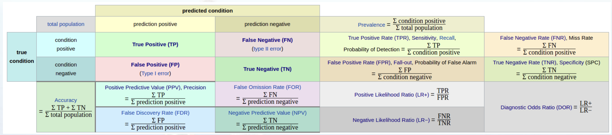
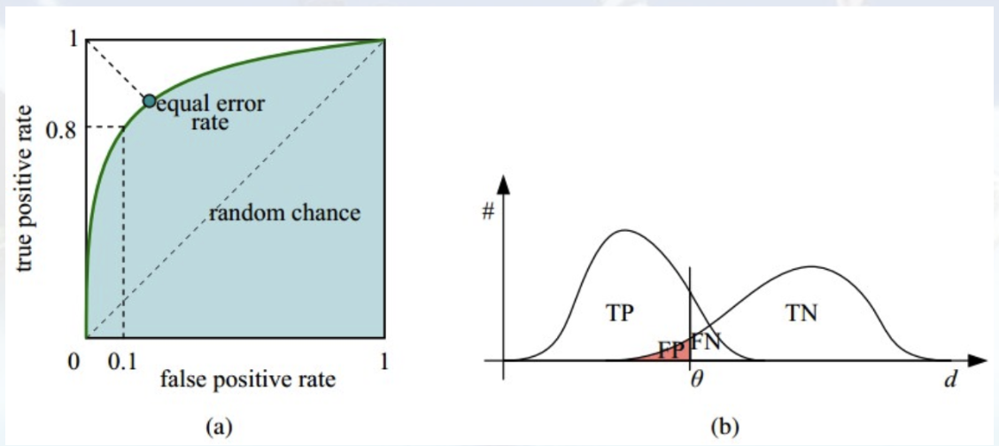
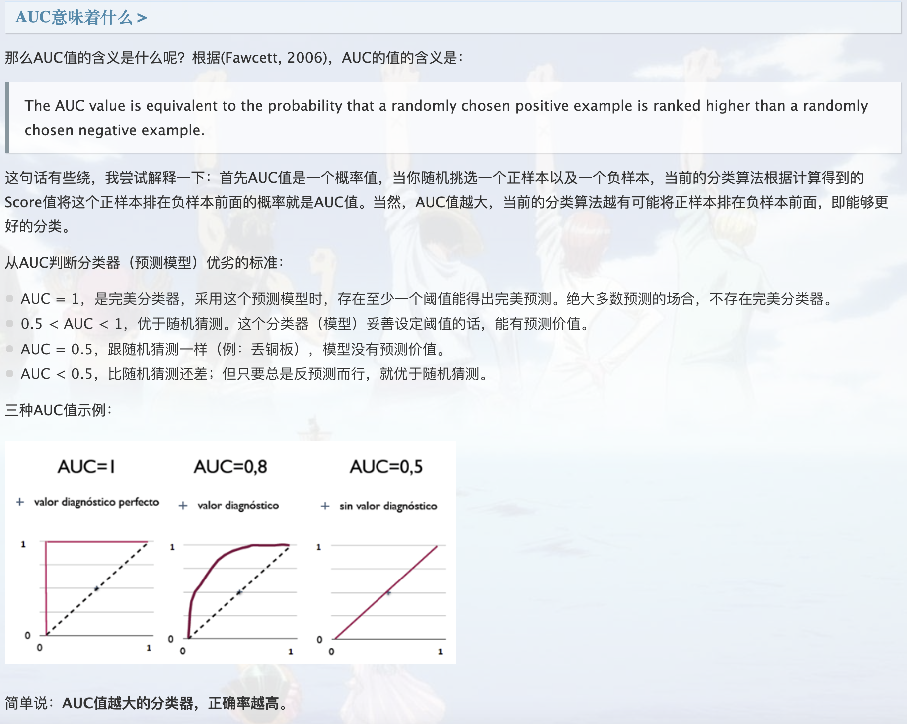
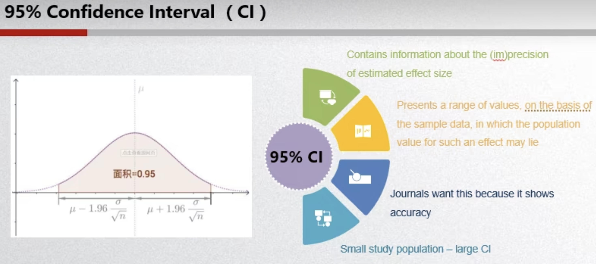

## ROC、AUC

- 正确率(`Precision`):

  $Precision = \frac{TP}{TP + FP}$

- 真阳性率(True Positive Rate, `TPR`)，灵敏度(``Sensitivity`)，召回率(`Recall`)：

  $Sensitivity = Recall = TPR = \frac{TP}{TP + FN}$

- 真阴性率(True Negative Rate, `TNR`)，特异度(`Specificity`):

  $Specificity = TNR = \frac{TN}{FP + TN}$

- 假阴性率(False Negatice Rate, `FNR`)，漏诊率(= 1 - 灵敏度)：

  $FNR = \frac{FN}{TP + FN}$

- 假阳性率(False Positice Rate, `FPR`)，误诊率(= 1 - 特异度)：

  $FPR = \frac{FP}{FP + TN}$

- 阳性似然比(``Positive Likelihood Ratio (LR+)`` )：

  $LR+ = \frac{TPR}{FPR} = \frac{Sensitivity}{1-Specificity}$

- 阴性似然比(``Negative Likelihood Ratio (LR-)`` )：

  $LR- = \frac{FNR}{TNR} = \frac{1-Sensitivity}{Specificity}$

- Youden指数(`Youden index`):

  Youden index = Sensitivity + Specificity - 1 = TPR - FPR

  

如下面这幅图，(a)图中实线为ROC曲线，线上每个点对应一个阈值

(a) 理想情况下，TPR应该接近1，FPR应该接近0。ROC曲线上的每一个点对应于一个threshold，对于一个分类器，每个threshold下会有一个TPR和FPR

比如threshold最大时，TP=FP=0，对应于原点；threshold最小时，TN=FN=0，对应于右上角的点(1, 1)

- 横轴FPR：1-TNR，1-Specificity，FPR越大，预测正类中实际负类越多
- 纵轴TPR：Sensitivity(正类覆盖率)，TPR越大，预测正类中实际正类越多
- 理想目标：TPR=1，FPR=0，即图中(0, 1)点，故ROC曲线越靠拢(0, 1)点，越偏离45度对角线越好，Sensitivity、Specificity越大效果越好

(b) P和N得分不作为特征间距离d的一个函数，随着阈值theta增加，TP和FP都增加

[机器学习之分类性能度量指标 : ROC曲线、AUC值、正确率、召回率](https://zhwhong.cn/2017/04/14/ROC-AUC-Precision-Recall-analysis/)

[模型评估指标AUC（area under the curve）_Webbley的博客-CSDN博客_auc指标](https://blog.csdn.net/liweibin1994/article/details/79462554)

## Delong’s test

比较AUC显著性差异

[Delong test_liuqiang3的博客-CSDN博客_delong检验](https://blog.csdn.net/liuqiang3/article/details/102866673)

## McNemar’s test

[如何计算McNemar检验，比较两种机器学习分类器 - 腾讯云开发者社区-腾讯云](https://cloud.tencent.com/developer/article/1178350)

## C-index

[临床研究中常用的评价指标AUC和C-index](https://zhuanlan.zhihu.com/p/383272878)

[Topic 13. 临床预测模型之一致性指数 (C-index)](https://zhuanlan.zhihu.com/p/485401349)

## P-value、confidence interval

[显著性检验：P值和置信度_Chipei Kung的博客-CSDN博客_显著性检验p值](https://blog.csdn.net/yu1581274988/article/details/117295802)

[灵敏度和特异度的置信区间怎么算？_mjiansun的博客-CSDN博客_敏感性置信区间](https://blog.csdn.net/u013066730/article/details/120760183)

## Non-inferiority

[临床试验中如何选择非劣效界值](https://zhuanlan.zhihu.com/p/400409860)

## T-test

[t-test](https://zhuanlan.zhihu.com/p/38243421)

## Kappa指数

[kappa系数_百度百科](https://baike.baidu.com/item/kappa%E7%B3%BB%E6%95%B0/9385025)

[Kappa系数简单介绍_gltangwq的博客-CSDN博客_kappa值](https://blog.csdn.net/gltangwq/article/details/106357443)

## 多分类AUC

[多分类ROC曲线及AUC计算_脚踏实地仰望星空的博客-CSDN博客_多分类roc曲线](https://blog.csdn.net/u010505915/article/details/106450150)