## ImageNet Classification with Deep Convolutional Neural Network

Authors: Krizhevsky, Alex Sutskever, Ilya Hinton, Geoffrey E.

DOI: https://doi.org/10.1145/3065386

Year: 2017

期刊杂志: ILSVR2012 Champion, NIPS2012

Open Source: https://github.com/machrisaa/tensorflow-vgg 非官方

Future: 解决video上的有监督学习问题

Meaning: 在无监督学习的大环境中，用大数据的有监督学习一举击败无监督，开辟彩虹大道

## 1. 第一遍 标题 摘要 结论

[沐神讲解](https://www.bilibili.com/video/BV1ih411J7Kz/?spm_id_from=333.788&vd_source=b60872cd374332ccebd93d8a3907fbc7)

### 1⃣️ 标题

ImageNet Classification with Deep Convolutional Neural Network

- `ImageNet`：当时最大的图片分类数据集，100w图片 1000类别
- `Deep Convolutional`：`卷积神经网络`工作原理是什么? 同时作者为什么要使用 `深度`的卷积神经网络。2012 convolution 没有tree SVM🔥
- `Neural Networks` ：神经网络，这篇文章使用了神经网络技术。

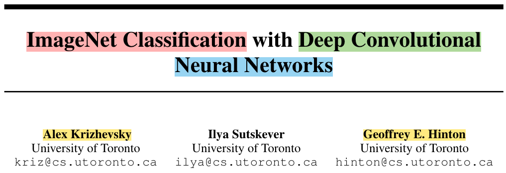

### 2⃣️ 摘要

- 干了什么？

  训练了一个large and deep的CNN，来分类120w图片的1000个类别
- 效果如何？

  比前人工作好

  top-1 error: 37.5%

  top-5 error: 17.0%
- 网络结构模样？

  600w参数 65w神经元

  5个卷积层（<5 max-pooling层）+ 3个全连接层（1000-way softmax）
- 参数太多，提高训练速度？

  non-saturating neurons + GPU实现卷积运算

[什么是non-saturating neurons非饱和神经元？](https://www.zhihu.com/question/264163033)

- 参数太多，过拟合了怎么办？

  避免FCN的过拟合，dropout正则effective
- 为什么我这么厉害？

  不告诉你，反正我是ILSVRC-2012的🏆，错误率比🥈低了10.9%

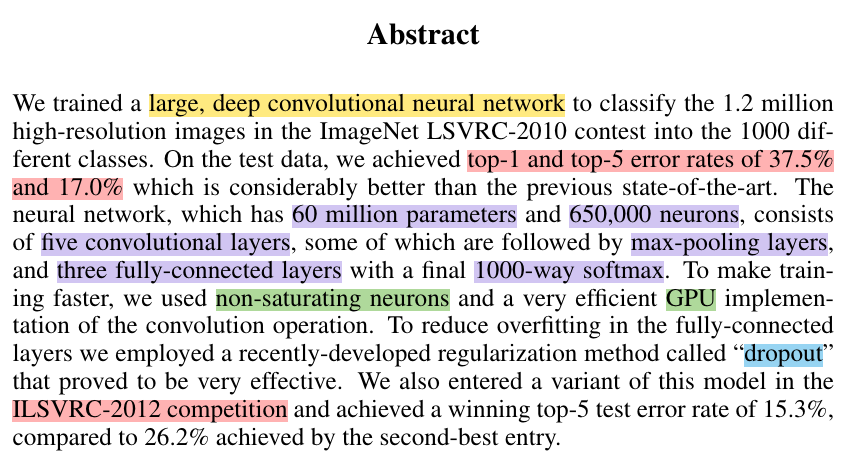

### 3⃣️ 结论

无conclusion和Abstract一一对应，只有discussion(吐槽) and future

#### Part1  文章总结

- **一句话，怎么总结我的好？**

  a large, deep convolutional neural network is capable of achieving record-breaking results (SOTA) on a highly challenging dataset（指的是ImageNet）using purely supervised learning.
- **什么情况，我会表现的不好呢？**

  remove a single convolutional layer

  i.e.,去掉中间层，降2%

**Depth is important**

- **深度重要，但深度是最重要的吗？**

  去掉一层convolutional layer, 降低2%，不能证明深度是最重要的
- **可能的情况**：没设置好参数

  AlexNet可以去掉一些层，调节中间参数，效果不变。直接砍掉一层，掉2%可能是搜索参数做的不够，没调好参数
- **反过来讲，结论没问题？**

  **深宽都重要**，i.e.,照片的高宽比

  深度重要 → CNN需要**很深**

 宽度也重要 → 特别深 + 特别窄 or 特别浅 + 特别宽 ❌

#### Part2 未来研究

- **我们没有做什么？**

  did not use any unsupervised pre-training
- **不用unsupervised pre-training 也没关系？**

  2012年的DL的目的是：像”人“（不一定知道真实答案） 书读百遍 其义自现

  通过训练一个非常大的神经网络，在没有标签的数据上，把数据的内在结构抽出来
- **关注的潮流怎么改变？**

  AlexNet之前大佬们爱：无监督学习

  （**Why dalao们不喜欢 有监督学习？**）

  （因为有监督学习打不过 树 SVM 😊）

  AlexNet 证明大力出奇迹，模型够大，有标签数据够多，我🏆

  最近大家一起爱：BERT、GAN
- **我们认为pre-training为什么好？**

  有充足计算资源可以增加网络size时，无需增加标注数据
- **我们有多牛？**

  我们可以通过 让网络变大，训练更久，变得更强

  但2012年的结果 和人类比还是有差距的

  Note: 现在图片里找简单的物品，DL比人类好很多，图片识别在无人驾驶的应用
- **我们怎么继续🐮呢？**

  在video上训练very large and deep CNN, 因为video里的时序信息可以辅助理解图片中的空间信息
- **这么牛的事情，大家做到了吗？**

  目前，video还是很难。why? 图片和语言进展不错，video 相对于图片的计算量大幅增加，video的版权问题

  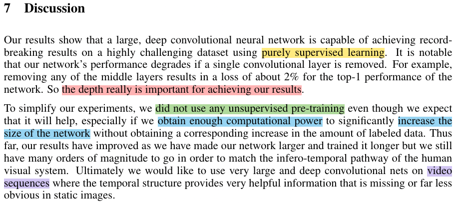

### 4⃣️ 重要的图和公式

- **结果测试展示：**

  效果在比较难的case表现不错

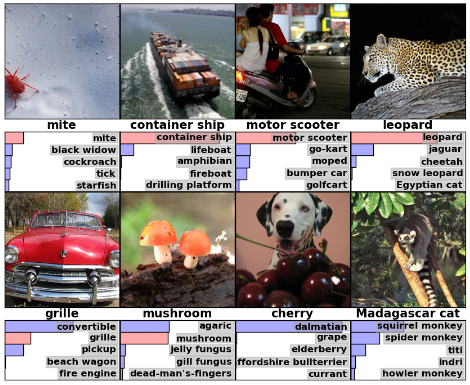

 motor scooter、leopard雪豹、grille敞篷车 ✅

 cherry ❌

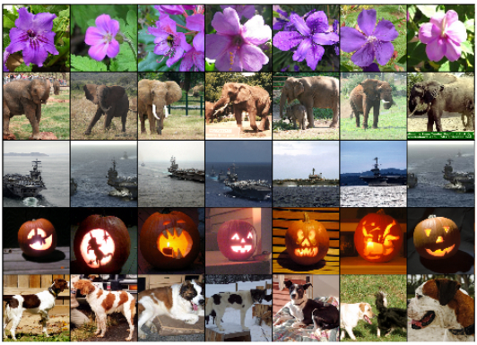

  向量集合：输入图片在CNN的倒数第二层的数，作为每个图片的语义向量

给定一张图片，返回和我向量相似的图片；结果靠谱，🌹、🐘、🎃、🐶 都差不多

- **本文最重要的是什么？real wow moment**

  Deep CNN训练的结果，图片最后向量（学到了一种嵌入表示）的语义表示特别好～！

  相似的图片的向量会比较近，学到了一个非常好的特征；非常适合后面的ML，一个简单的softmax就能分类的很好！

  学习嵌入表示，DL的一大强项

  和当前最好的结果的对比：远远超过别人（卖点、wow moment、sexy point）

  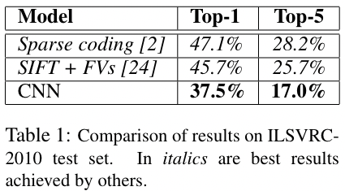

  96个卷积核，学习不同模式

  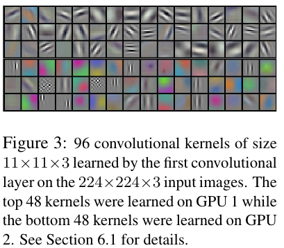

  模型架构图

  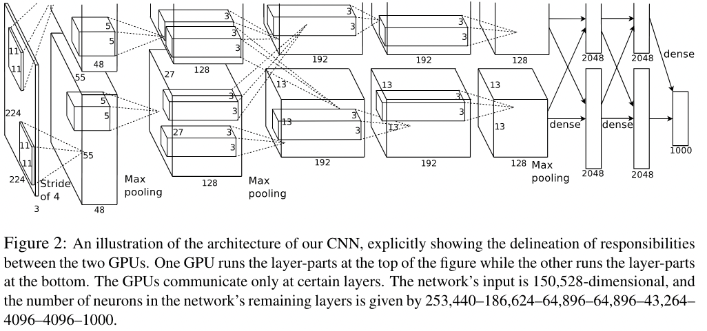

  第一遍可能看不懂

  **第一遍能看懂什么图？**

  实验结果图，比较了解的方向的模型结构图。以后第一遍读论文，遇到比较新、开创性、看不懂的模型结构图，第一遍放下，后面再看

  **第一遍的印象：**结果特别好、NN实现的、为什么好？怎么做的？

  **第一遍读完做什么？**

  要不要继续读？

  不读：很好用的 视觉网络；研究无关，放弃

  读：CV研究者，工作很好，赢了今年的比赛，明年大家都用这个模型打比赛，我不试试吗？hhhh

  参考：[沐神讲解](https://www.bilibili.com/read/cv13828723?from=note)

## 2. 第二遍 过一遍看

[沐神讲解](https://www.bilibili.com/video/BV1hq4y157t1/?spm_id_from=333.788&vd_source=b60872cd374332ccebd93d8a3907fbc7)

### 1. Introduction

1⃣️ 第一段

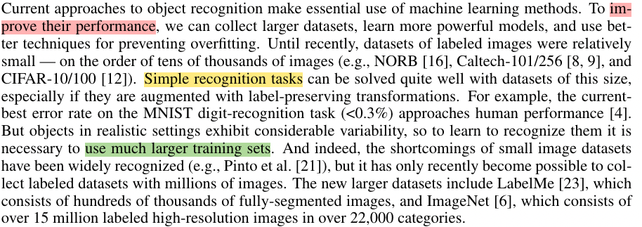

2⃣️ 第二段

描述了怎么做神经网络，这里只介绍了CNN

写论文的时候 ，千万不要只说自己这个领域这个小方向大概怎么样，还要提到别的方向怎么样

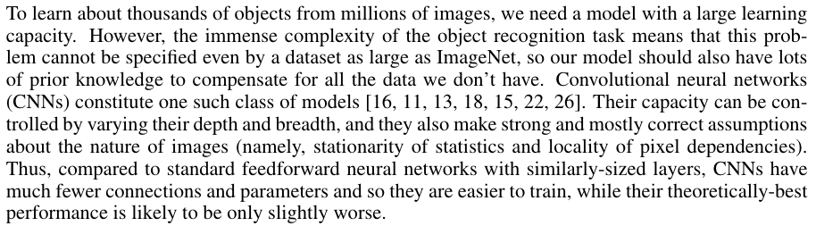

3⃣️ 第三段

4⃣️ 第四段

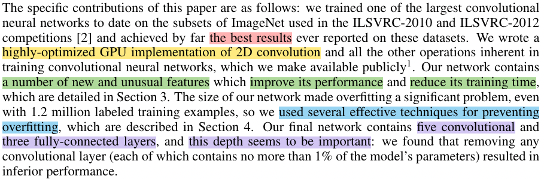

作者还强调了由于GPU内存的限制，在两块GPU上进行训练时需要5-6天时间，如果能有更快的GPU和更大的数据集，网络性能还能进一步提升

### 2. The Dataset

    介绍了整个数据集大约有1500万张图片，共有22000类。ILSVRC比赛共有1000类，每一类大约有1000张图片。在2010的比赛中，可以得到测试集数据标签，但是在2012年的比赛中则没有测试集标签

   由于ImageNet数据集图片精度并不相同，因此我们每一张图片下采样到256 × 256。当短边尺寸小于256时，我们先上采样到256，然后再从图片中截取 256 × 256的图片作为输入。我们没有对图片进行任何的预处理，整个网络是在每个像素的原始RGB值进行训练（也就是端到端训练，这也是深度学习的一大优势）

- 将图片的短边减少到256，长边是保证高宽比不变的情况下也往下降，长边如果依然多出来的话，如果多于256的话，就以中心为界将两边裁掉，裁成一个256*256的图片
- 没有做任何的预处理，只是对图片进行了裁剪
- 网络是在raw RGB Value上训练的
- 当时做计算机视觉都是将特征抽出来，抽SIFT也好，抽别的特征也好（imagenet数据集也提供了一个SIFT版本的特征），这篇文章说不要抽特征，直接是在原始的Pixels上做了
- 在之后的工作里面基本上主要是end to end（端到端）：及那个原始的图片或者文本直接进去，不做任何的特征提取，神经网络能够帮助你完成这部分工作

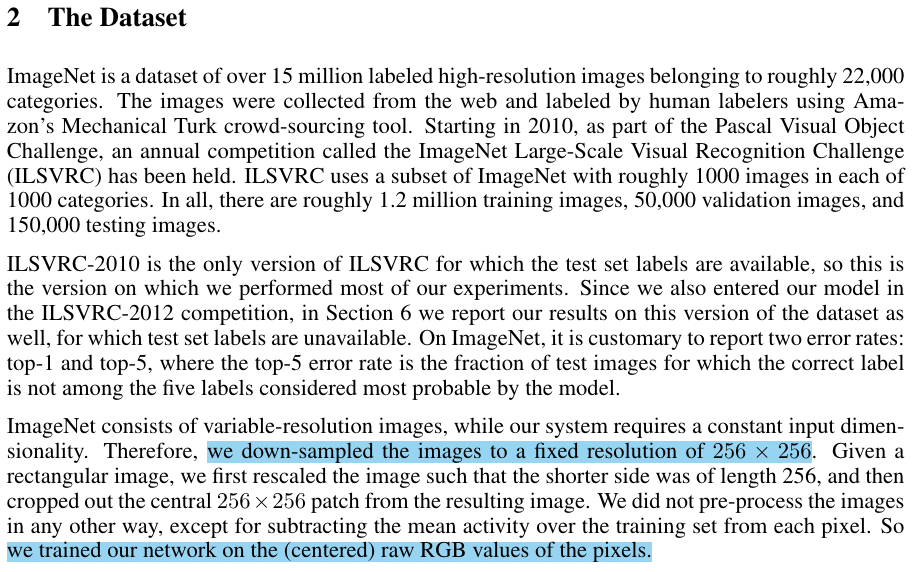

### 3. The Architecture

- 3.1 ReLU非线性激活函数，函数形式为 f(x) = max(0,x)，形式比较简单。作者说这是一个非饱和的非线性函数，比其它激活函数训练要快（具体原因没解释），关于ReLU函数的具体介绍可以看参考文献[20]。作者做了一个实验，如图1所示，在将错误率降低到25%时，ReLU比tanh函数训练时要快6倍

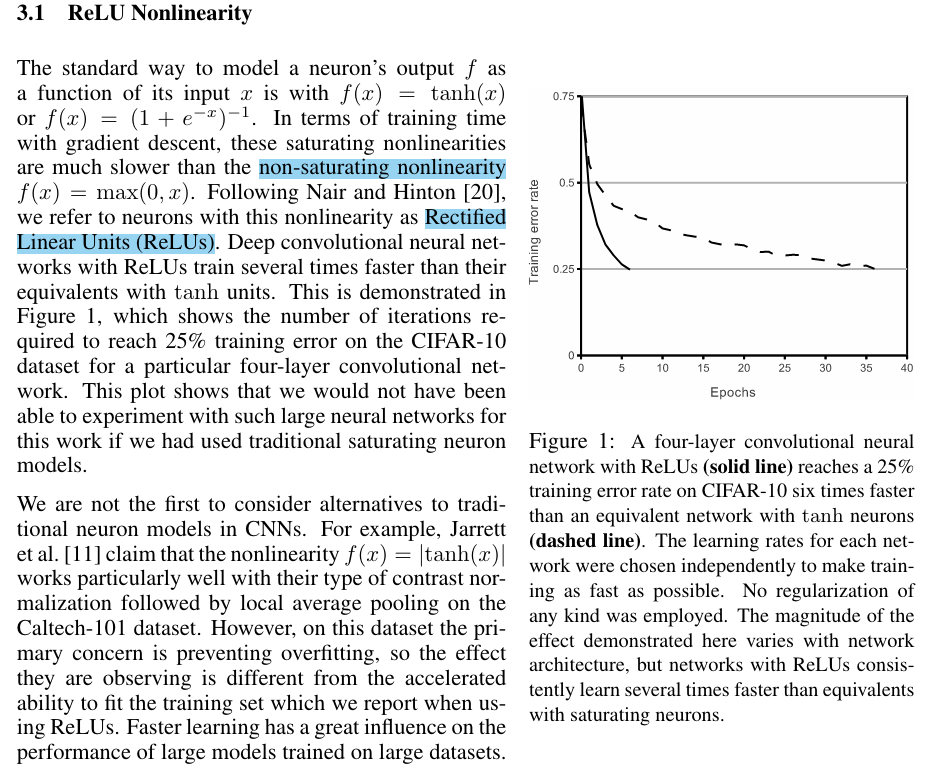

- 3.2 使用了多GPU进行训练

  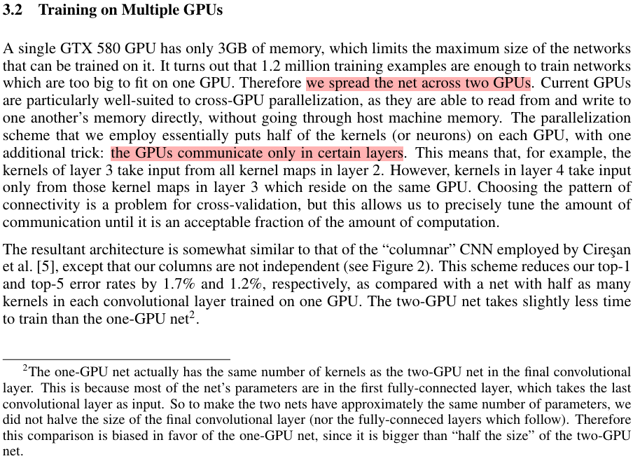
- 3.3 正则化、归一化

  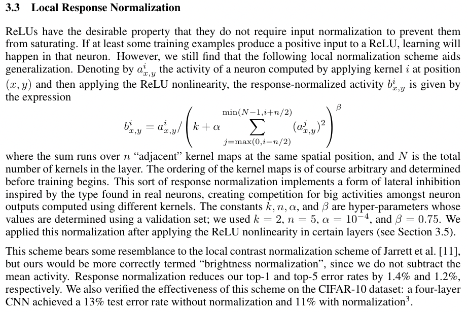
- 3.4 Overlapping Pooling

  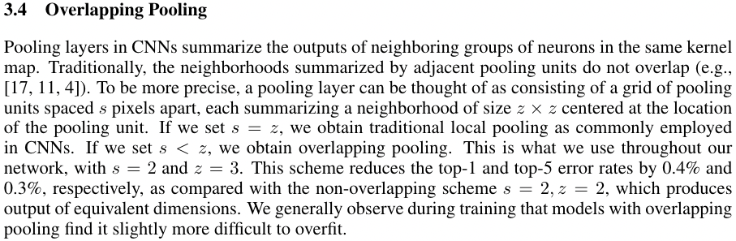
- 3.5 Overall Architecture

  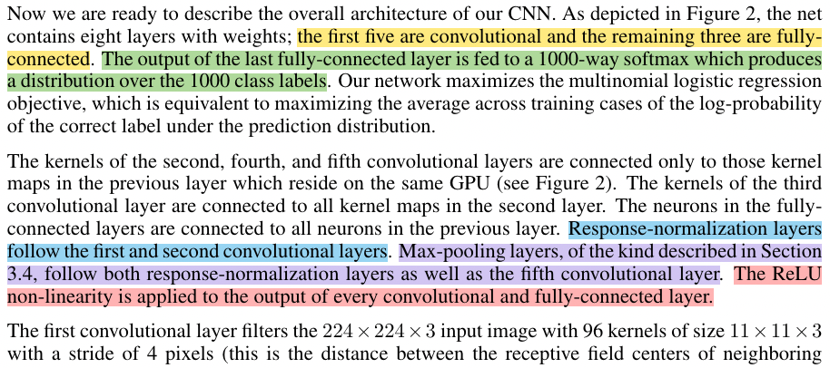

  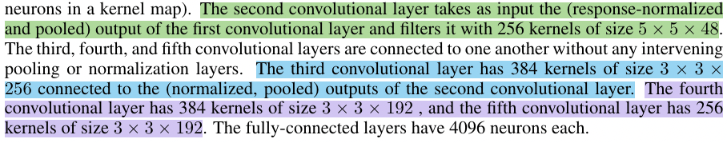

- 方框表示每一层的输入和输出的数据的大小
- 输入的图片是一个高宽分别为224 x 224的3通道RGB图片
- 第一层卷积：卷积的窗口是11 x 11，有48个输出通道，stride等于4
- 有两个GPU，GPU1和GPU0都有自己的卷积核参数

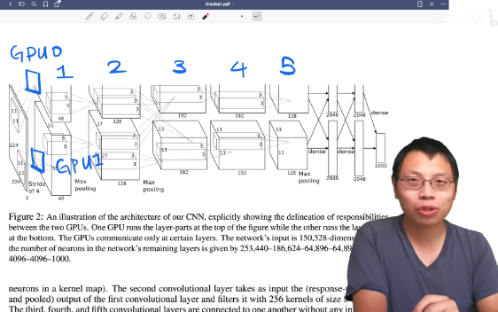

- 第1个卷积层在两个GPU上各有一个
- 第2个卷积层是在每个GPU把当前的卷积结果拿过来（GPU0的第二个卷积层读的是GPU0的第一个卷积层的卷积结果，GPU0和GPU1之间没有任何通讯）
- 到第3个卷积层的时候，GPU还是每个GPU上有自己的卷积核，但是每个卷积核会同时将第二个卷积层中GPU0和GPU1的卷积结果作为输入，两个GPU之间会通讯一次
- 第4、5个卷积层之间没有任何通讯
- 每个卷积层的通道数是不一样的，通道数有所增加，高和宽也有所变化
- 高宽慢慢变小、深度慢慢增加，随着深度的增加，慢慢地将空间信息压缩，直到最后每一个像素能够代表前面一大块的像素，然后再将通道数慢慢增加，可以认为每个通道数是去看一种特定的模式（例如192个通道可以简单地认为，能够识别图片中的192种不同的模式）
- 慢慢将空间信息压缩，语义空间慢慢增加，到最后卷积完之后，进入全连接层
- 全连接层中又出现了GPU之间的通讯，全连接层的输入是每个GPU第五个卷积的输出合并起来做全连接

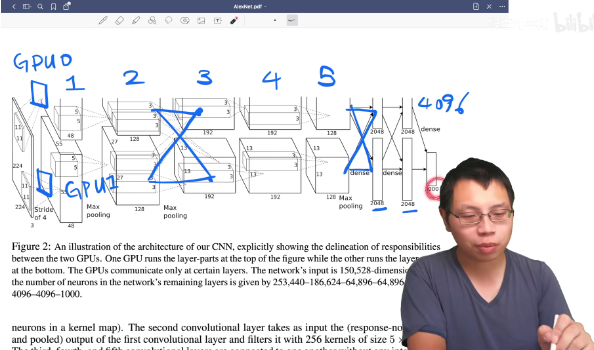

- 最后进入分类层的时候，变成了一个4096长的向量，每一块来自两个GPU，每片是2048，最后拼起来，所以一张图片会表示成一个4096维的向量，最后用一个线性分类做链接
- 深度学习的主要作用是将一张输入的图片，通过卷积、池化、全连接等一系列操作，将他压缩成一个长为4096的向量，这个向量能够将中间的语义信息都表示出来（将一个人能够看懂的像素通过一系列的特征提取变成了一个长为4096的机器能够看懂的东西，这个东西可以用来做搜索、分类等）
- 整个机器学习都可以认为是一个知识的压缩过程，不管是图片、语音还是文字或者视频，通过一个模型最后压缩成一个向量，然后机器去识别这个向量，然后在上面做各种事情
- 模型并行（model parallel）：现在在计算机视觉里面用的不多，但是在自然语言处理方面又成为主流了（将模型切开进行训练）

### 4. Reducing Overfitting

**数据增强(data augmentation)**

- 把一些图片人工地放大
- 在图片中随机地抠出一部分区域，做一些新的图片
- 把整个RGB的颜色通道channel上做一些改变，这里使用的是**PCA(主成分分析)**的方法，颜色会有不同，因此每次图片跟原始图片 是有一定的不同的

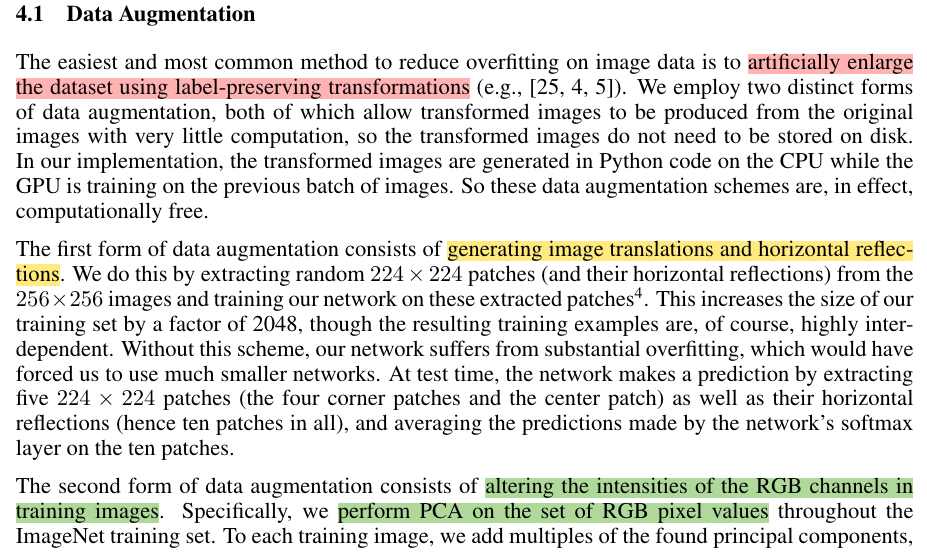

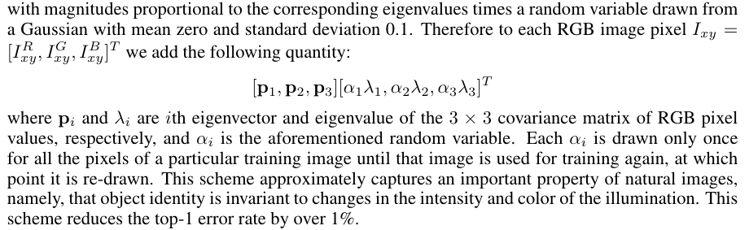

 **Dropout**

- 随机的把一些隐藏层的输出变成用50%的概率设为0，每一次都是把一些东西设置为0，所以模型也就发生了变化，每次得到一个新的模型，但是这些模型之间权重是共享的除了设置成0的，非0的东西都是一样的，这样就等价于做了模型融合
- 后来大家发现dropout其实也不是在做模型融合，更多的dropout就是一个正则项(dropout在现行模型上等价于一个L2正则项)
- 这里将dropout用在了前面的两个全连接层上面
- 文章说没有dropout的话，overfitting会非常严重，有dropout的话，训练会比别人慢两倍
- 现在CNN的设计通常不会使用那么大的全连接层，所以dropout也不那么重要，而且GPU、内存也没那么吃紧了
- dropout在全连接层上还是很有用的，在RNN和Attension中使用的非常多

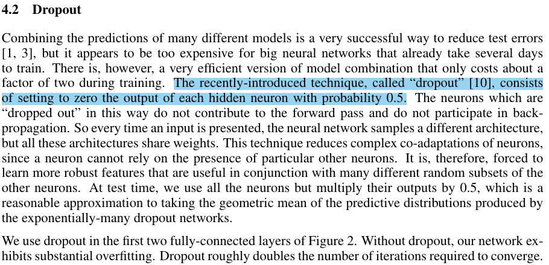

### 5. Details of learning

**讲述了模型是如何训练**

- 使用SGD（随机梯度下降）来进行训练，SGD调参相对来说可能会比较难调，后来发现SGD里面的噪音对模型的泛化性其实是有好处的，所以现在深度学习中普遍使用SGD对模型进行训练。在这个文章之后SGD基本上在机器学习界成为了最主流的一个优化算法
- batch size = 128
- momentum = 0.9
- weight decay是0.0005，也就是L2正则项，但是这个东西不是加在模型上，而是加在优化算法上，虽然他们两个是等价关系，但是因为深度学习的学习，所以大家现在基本上把这个东西叫做weight decay了
- momentum也是因为这篇文章之后用的特别多，虽然在2010年的时候有大量的加速算法，里面有很fancy的各种加速SGD算法，但是现在看起来似乎用一个简单的momentum也是不错的
- momentum实际上是，当优化的表面非常不平滑的时候，冲量使得不要被当下的梯度过多的误导，可以保持一个冲量从过去那个方向，沿着一个比较平缓的方向往前走，这样子不容易陷入到局部最优解
- 权重用的是一个均值为0，方差为0.01的高斯随机变量来初始化（0.01对很多网络都是可以的，但是如果特别深的时候需要更多优化，但是对于一些相对简单的神经网络，0.01是一个不错的选项）
- 现在就算是比较大的那些BERT，也就是用了0.02作为随机的初始值的方差
- 在第二层、第四层和第五层的卷积层把初始的偏移量初始化成1，剩下的全部初始化成0
- 每个层使用同样的学习率，从0.01开始，然后呢如果验证误差不往下降了，就手动的将他乘以0.1，就是降低十倍
- ResNet中，每训练120轮，学习率每30轮就下降0.1另外一种主流的做法就是，前面可以做得更长一点，必须能够60轮或者是100轮，然后再在后面下降
- 在Alex之后的很多训练里面，都是做规则性地将学习率往下下降十倍，这是一个非常主流的做法，但是现在很少用了，现在使用更加平滑的曲线来降低学习率，比如果用一个cos的函数比较平缓地往下降。一开始的选择也很重要，如果选的太大可能会发生爆炸，如果太小又有可能训练不动，所以现在主流的做法是学习率从0开始再慢慢上升，慢慢下降
- 模型训练了90个epoch，然后每一遍用的是ImageNet完整的120万张图片，需要5-6天在两个GTX GPU上训练

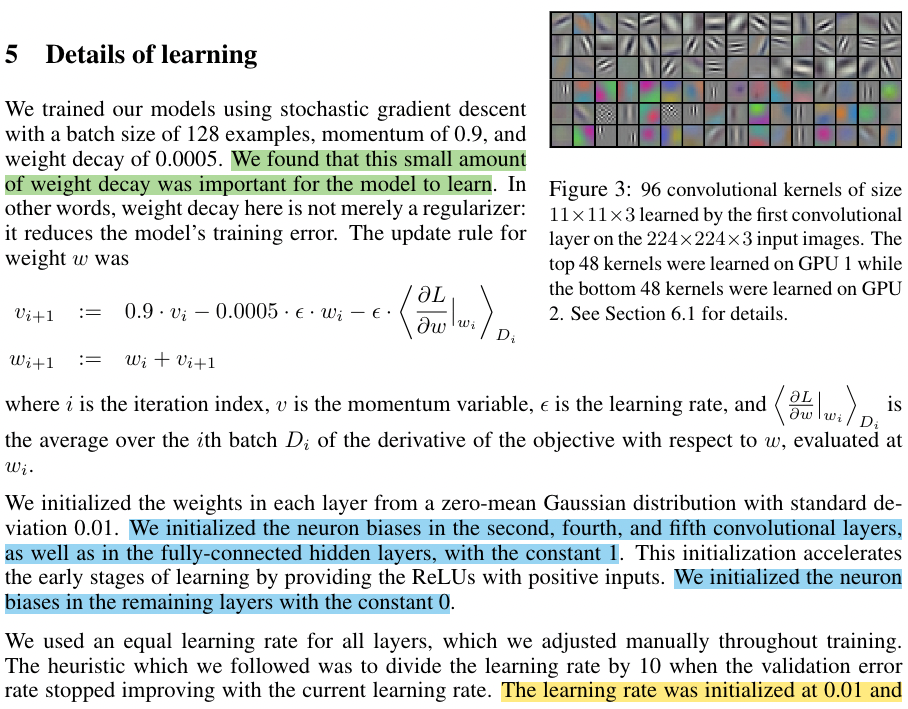

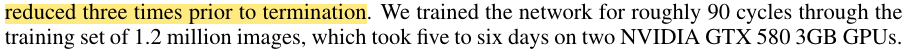

### 6. Results

- 下面是论文实验结果部分，可以看到在 `ILSVRC-2010/2012`数据上作者都取得了最低的错误率，同时作者也在2009年版本的 `ImageNet`全部数据上进行了训练，不过在 `ImageNet`全部数据集上进行训练的研究比较少

  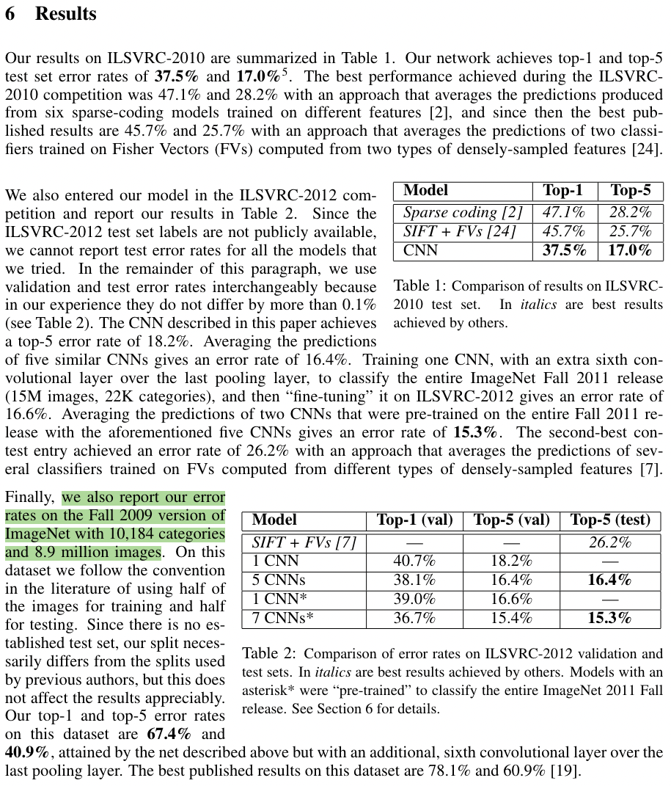
- 作者在训练时也发现了一些有意思的现象，就是两个GPU，一个GPU上和卷积核和图像颜色是有关的，一个和图像颜色是无关的，这个还待解释。另一个是图4所示，当最后一个隐藏层（4096）神经元欧几里得空间距离相近是，两张图片基本上是同一类（深度学习的解释性也是一个很重要的研究方向）

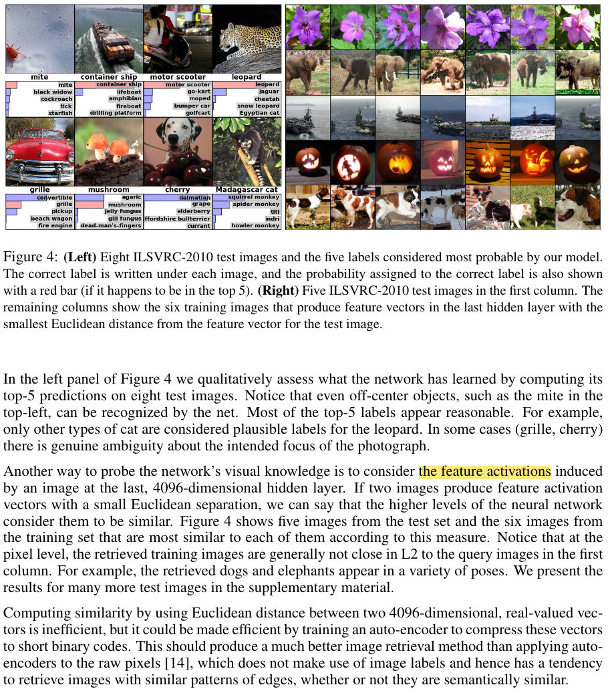
